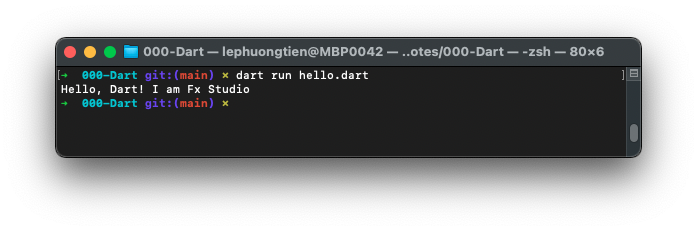
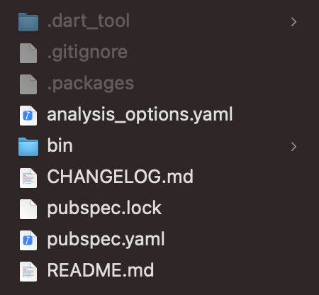
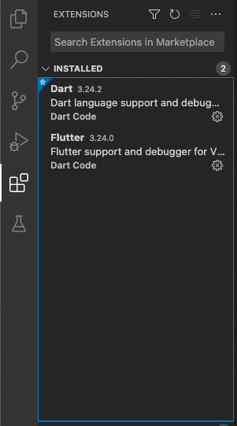
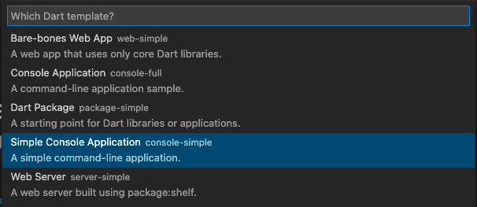
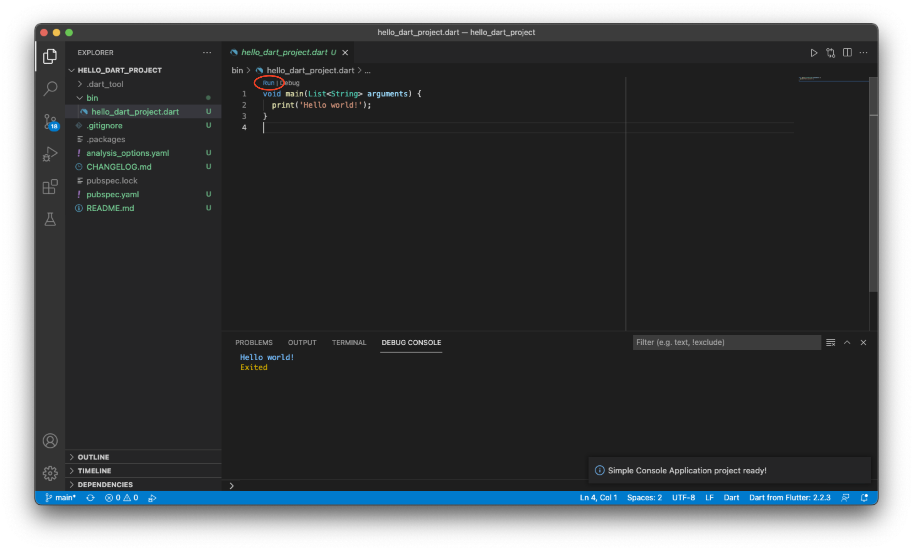

# 01 - Hello world

## Chuẩn bị

Công cụ editor thì khá đơn giản:

* TextEditor
* Visual Studio Code (nền dùng)

Hoặc vào trang https://dartpad.dev/ để tiến hành code luôn. Khá là giống với Playground của Swift.

Về **Visual Studio Code**, bạn tải phần mềm đó về và tiến hành cài đặt theo hướng dẫn từ trang chủ

* “https://dart.dev/get-dart ”

Cũng khá là đơn giản và mất mấy nốt nhạc là xong. Sau khi cài đặt xong, bạn nên thử vài lệnh cơ bản xem Dart đã có chưa và ăn chưa. Ví dụ:

```shell
dart --version
```

Để xem version của SDK Dart của bạn. Hoặc bạn có thể gọi lên `help` để xem nhiều lệnh hơn.

```shell
dart help
```

> Nhưng mà cũng không quan trọng mấy.

## Command Line

### Thực thi file Dart riêng lẻ

Khi bạn có một file `*.dart` và thực thi nó, hãy dùng tới Terminal nhoé. Ví dụ bạn có 1 file với tên là `hello.dart` như sau:

```dart
void main() {
    print('Hello, Dart! I am Fx Studio');
}
```

Để thực thi file này, bạn cần di chuyển về thư mục chứa nó. Dùng lệnh `cd` trên Terminal. Sau đó sử dụng lệnh `dart run` như sau:

```shell
dart run hello.dart
```

Kết quả thực thi như sau:



Như vậy, bạn đã **Hello world** xong Dart ở Command Line với file Dart riêng lẻ rồi.

### Dart Project

Mặc dù, bạn có thể vào web để code hay tạo các file Dart riêng lẻ để code. Nhưng thực tế cuộc sống thì ít ai làm như vậy lắm.  Chúng ta cần một Dart Project để tiện code, thực thi và cấu hình nhiều thứ hơn. Chúng ta sẽ có các bước sau:

* Create Dart Project

```shell
dart create hello_project
```

Với lệnh Terminal như trên thì bạn nhanh chóng tạo ra được một Dart Project với tên là `hello_project`.

> Quy tắt đặt tên của Dart & Flutter thì theo snake nhoé.

* Run Project

Để thực thi project này, bạn cần di chuyển về thư mục project.

```shell
cd hello_project
```

Và lệnh thực thi như sau:

```shell
dart run bin/hello_project.dart
```

Hoặc bạn có thể bỏ qua từ khoá `run` cũng được.

```shell
dart bin/hello_project.dart
```

Khá đơn giản phải không nào.

## Cấu trúc Dart Project



Đâu là cấu trúc thư mục của Dart Project vừa tạo ở trên. Ý nghĩa cơ bản của nó như sau:

* **bin** chứa các file thực thi `*.dart` của project
* Trong file có `hello_project.dart` file đầu tiên được tạo ra và chúng ta đã thực thi ở trên
* `.gitignore` định nghĩa những gì mà git local của bạn không push lên git remote
* `analysis_options.yaml` không cần biết cũng được
* `CHANGELOG.md` & `README.md` chỉ là mô tả về project, không cần thiết
* `pubspec.yaml` đây là file chứa các khai báo thư viện bên ngoài cho project. Gọi là `pub dependencies`

Tạm thời, bạn biết như vậy là oke rồi. Chứng sẽ tìm hiểu nhiều hơn ở Flutter sau.

## Visual Studio Code

Đây là một Editor rất phù hợp với Dart & Flutter. Nhẹ nhanh lại free nữa.

### Cài đặt Dart môi trường cho VS Code

Bạn có thể google vài đường là ra rất nhiều. Chỉ cần bạn có thể tạo được các mẫu Dart Project bằng VS Code là oke.

Bạn chỉ cần vào phần Extension của VS Code và gõ `Dart` hay `Flutter` và cài đặt thôi. Khá đơn giản.



### Create Project

Sau khi cài đặt các thứ linh tinh cho VS Code oke rồi. Bạn tiến hành tạo project bằng VS Code thôi.

* Bắt đầu từ **Menu > View > Command Palette** và chọn **Dart Project**
* Sau đó chọn template cho phù hợp. Chúng ta sẽ chọn **Simple Console Application**



* Chọn thư mục cho Project mới
* Đặt tên cho Project

Vậy là xong. Bạn chỉ cần kích vào chữ `run` để thực thi project là được.



Với file `*.drat` được tạo ra lúc tạo project thì như sau:

```dart
void main(List<String> arguments) {
  print('Hello world!');
}
```

Cũng không có gì phải lo lắng vì `arguments` là các đối số truyền từ console vào để cung cấp giá trị ban đầu cho chương trình. Rất giống C hay Java. Và bạn có thể xoá chúng nó đi cũng không có gì ảnh hưởng.

```dart
void main() {
  print('Hello world!');
}
```

## Tạm kết

* Thực thi file `*.dart` bằng Command Line
* Tạo project theo 2 cách: Command Line & VS Code
* Ngoài ra, còn có nhiều thứ hay nữa, bạn từ từ khám phá VS Code nhoé.

---

Cảm ơn bạn đã theo dõi các bài viết từ **Fx Studio** & hãy truy cập [website](https://fxstudio.dev/) để cập nhật nhiều hơn!
