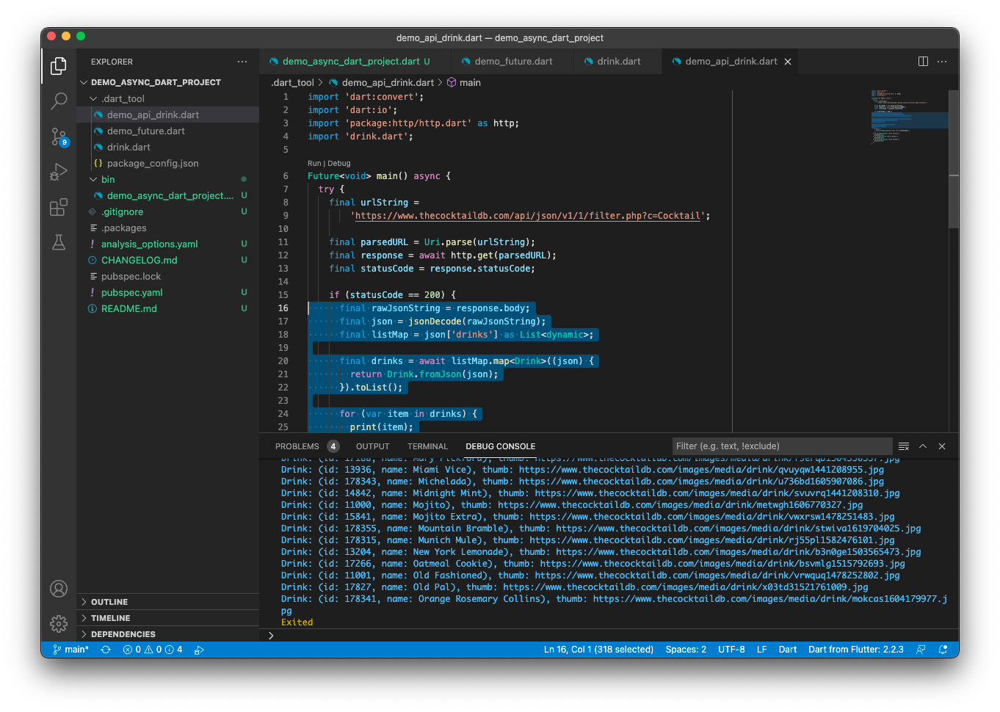

# Asynchronous

Chào mừng bạn đến với **Fx Studio**. Hành trình tới đây cũng xem là đoạn cuối của chuyến tham quan 0 đồng trong vũ trụ của **Dart** rồi. Và đây cũng là một phần rất quan trọng trong **Dart** hay **Flutter** sắp tới. Mình mượn tạm cái tên **Asynchronous** cho bài viết này, tuy nhiên kiến thức sẽ có nhiều hơn là **Asynchronous**. Nào ...

> Bắt đầu thôi!

## Concurrency trong Dart

Cuộc đời bấy kì dev nào cũng vui vẻ hết, cho tới khi đụng tới đa luồng, concurrency, bất đồng bộ ... là ác mộng ùa về. Các ngôn ngữ lập trình đều tiến hoá để trở nên đa luồng hơn, xử lý tối ưu hơn ... Nhưng một sự thật khá là vui, khi ...

> Dart, in particular, is a single-threaded language.

Thực chất các ngôn ngữ lập trình trước 1990 đã có đa luồng rồi, mà Dart thì 2011 tại sao vẫn là đơn luồng. Có thuyết âm mưu nào ở đây không. Chúng ta sẽ dần dần bóc tách tiếp nha.

### **Parallelism vs. concurrency**

Cũng như bao ngôn ngữ lập trình khác, khi tìm hiểu về bất đồng bộ thì sẽ gắn liền với 2 khái niệm này. Đơn giản nhất là:

* **Parallelism** khi bạn thực hiện nhiều task cùng một thời điểm trên bộ vi đa xử lý hoặc nhiều core (nhân) của CPU
* **Concurrency** là bạn đồng thời xử lý nhiều task thay phiên nhau trên cùng 1 core CPU.

Muôn đời thì **Parallelism** vẫn tốt hơn, khi chúng tối ưu được phần cứng và các task vụ thực hiện độc lập với nhau.

Tuy nhiên, có ưu thì phải có nhược và Parallelism cũng không tránh khỏi. Vấn đề xảy ra khi nhiều luồng cùng tác động và một dữ liệu, thay đổi chúng ... hệ quả dẫn tới nhiều vấn đề đau thương hơn bạn nghĩ.

Nhiều ngôn ngữ lập trình với thiết kế đa luồng, nhưng chúng cũng hạn chết bạn trong một số tác vụ nhất định. Để đảm bảo sự hoạt động của chương trình là tốt nhất.

### isolate

Với đơn luồng của Dart, những gì được chạy trong đó thì gọi là **isolate**. Mỗi isolate trong Dart, thì được cấp phát vùng nhớ riêng biệt, nhằm không bị ảnh hưởng qua lại với nhau. Điều này có nghĩa hệ thông sẽ phức tạp và đảm bảo tính toàn vẹn của dữ liệu.

> Một hệ thống như vậy làm giảm đáng kể tải nhận thức đối với một lập trình viên.

Và vẫn có nhược điểm, hệ quả kéo theo là chương trình sẽ chạy chậm. Về thực tế, chúng ta không thể nào tạo ra các chương trình gây quá tải CPU được. Hầu như các tác vụ xảy ra đồng thời đối với cảm nhận của người dùng. Concurrency làm rất tốt việc này. Nó sẽ giảm thời gian xuống mức thấp nhất có thể.

Fun fact ...

> *Flutter needs to update the UI 60 times a second, where each update timeslice is called a frame.* 

### **Synchronous vs. asynchronous code**

Ở trên là các khái niệm liên quan tới cấu trúc của máy và cách nó vận hành. Còn đối với code thì bạn sẽ có 2 khái niệm là:

* Synchronous (đồng bộ)
* Asynchronous (bất đồng bộ)

Hai khái niệm này thì hầu như các bạn dev nào cũng biết hết rồi. Hiểu nôm na, đoạn code của bạn sẽ thực hiện một việc nào đó và nó sẽ được thực hiện như thế nào trong cả một chương trình?

* Nếu nó tuần tự, trước chạy trước, sau chạy sau. Thì đó là đồng bộ
* Nếu nó tách biệt với dòng chảy thời gian của chương trình, 1 mình một cõi. Tuy nhiên, kết quả vẫn phải trả về luồng chính thì là bất đồng bộ. Không quan tâm tới thứ tự thực hiện các công việc. Còn trường hợp chạy luôn không về là lỗi nhoé

Ví dụ vui thôi cho code đồng bộ, còn bất đồng bộ thì để sau nhoé:

```dart
print('1');
print('2');
print('3');
```

Ví dụ cho bất đồng bộ đơn giản nhất là khi bạn đọc file hay tương tác với API ... ta cần thực hiện bất đồng bộ để đảm bảo giao diện của chương trình vẫn hoạt động ổn.

Tụi nó cũng như **Parallelism vs. concurrency**, ảnh hướng lớn nhất là tới giá trị của dữ liệu, nhất là các dữ liệu dùng chung. Bạn phải đối mặt với các vấn đề như Race conditions hay các deadlock ... Do đó, cũng cần phải hiểu được bản chất của chúng để có những thiết kế phù hợp cho chương trình của bạn.

### **The event loop**

Bản chất Dart là ngôn ngữ được thiết kế với **single thread** nên thực hiện **concurrency** trên nó cần phải có quản lý tốt. Dart gọi nó là **event loop** để thực hiện các tác vụ hoặc dừng các tác vụ khác. **Event loop** có 2 queue:

* **microtask queue** là hàng đợi được dùng nhiều nhất
* **event queue** dùng để thu thập sự kiện người dùng

Sự hoạt động trong Dart như sau:

* **Synchronous tasks** trong **main** thì luôn luôn phải được chạy ngay, bạn không thể dùng chúng được
* **long-running tasks** thì bạn có thể dừng và chuyển nó qua **event queue**
* Khi **synchronous tasks** chạy xong thì Dart sẽ kiểm tra **microtask**. Nếu còn task thì sẽ đưa vào **main thread** để chạy tiếp. Nó sẽ lặp lại khi **microtask** hết task.
* Cả 2 **synchronous tasks & microtask** đều hết rồi, thì event loop sẽ dừng chờ.
* Khi có một task mới vào **microtask** thì nó sẽ chờ các task trước đó thực thi xong rồi mới tới lượt mình chạy.
* Quá trình này sẽ thực thi tới khi nào tất cả các queue đều rỗng

### Running code in parallel

Khi nói Dart là ngôn ngữ với single thread thì không có nghĩa nó có 1 thread duy nhất trong vùng cách lý (the isolate). Và cũng không có nghĩa là bạn không chạy tác vụ trên một thread khác được. Ngoài việc đảm bảo giao diện, xử lý sự kiện người dùng, thì nó cũng phải lên lịch và xử lý I/O. Các công việc này hầu như diễn ra song song trên nhiều thread.

Một cách tiếp cận khác của Dart là tạo ra các vùng cách ly mới (new isolate). Nhiệm vụ và đặc tính của chúng là cách ly dữ liệu và vùng này không xâm phạm vùng khác được. Tuy nhiên, chúng vẫn giao tiếp thông qua các communicate messages.

Bạn sẽ không phải thường xuyên tạo ra chúng đâu. Lúc nào, bạn cần thực hiện các tác vụ dài trên main. Nó gây ảnh hưởng tới giao diện thì lúc đó isolate sẽ giúp bạn ... Chúng ta sẽ tìm hiểu nó ở dưới thôi.

## Futures

**Future** trong Dart là một kiểu dữ liệu, chứ không phải là tương lại nhoé. Về cơ bản, nó là một lời hứa (**Promise**) sẽ trả lại giá trị cho bạn trong tương lai.

### Khai báo

```dart
Future<int> countItems();
```

Trong đó:

* **Future** là một generic, bạn cần cung cấp một kiểu dữ liệu làm hạt nhân cho nó.
* Hàm `countItems()` sẽ trả về một kiểu là `Future<int>` trong một thời điểm nào đó ở tương lai

Bạn sẽ xử dụng Future cho các tác vụ mà bạn không biết chắc được thời gian chúng hoàn thành. Hoặc các tác vụ bất đồng bộ.

### Trạng thái

**Future** là kết quả của hoạt động bất đồng bộ và có 2 trạng thái là **chưa hoàn thánh** và **hoàn thành**:

- **Chưa hoàn thành**: khi chúng ta gọi một hoạt động bất đồng bộ, nó sẽ trả về một *Future* chưa hoàn thành, đây trạng thái của *Future* trước khi trả về kết quả.
- **Hoàn thành**: khi hoạt động bất đồng bộ thực hiện xong thì *Future* sẽ ở trạng thái hoàn thành, *Future* có thể hoàn thành với một **giá trị** hoặc là một **lỗi**.

**Future** hoàn thành với một giá trị thì nó có thể là `Future<T>` với giá trị có kiểu T, `Future<String>` với giá trị kiểu String hoặc là một giá trị void với `Future<void>`.

**Future** hoàn thành với một lỗi khi mà hoạt động bất dồng bộ bị thất bại vì một lí do nào đó.

### Ví dụ:

Ta sẽ xem qua ví dụ đơn giản nhất nhoé 

```dart
  final myFuture = Future<int>.delayed(
    Duration(seconds: 1),
    () => 42,
  );

  print(myFuture);
```

Trong đó:

* `myFuture` có kiểu dữ liệu là `Future<int>`
* Đối số đầu tiên là `Duration(seconds: 1)`. Tức sau khoảng thời gian 1 giây thì Dart sẽ thêm một hàm ẩn danh (block hay closure) vào tham số thứ 2
* Hàm ẩn danh đó sẽ trả về giá trị là `42`

Khi in ra kết quả thì bạn sẽ thấy khá buồn.

```
   Instance of 'Future<int>'
```

### Callback

Tiếp theo, bạn sẽ học cách để lấy giá trị có được trong một **Future**. Vì chúng nó có 2 trạng thái & 2 giá trị, nên chúng ta lại cần sử dụng các từ khoá sau đây:

* `then` để lấy giá trị khi Future kết thúc, nó có kiểu là kiểu mình khai báo generic với Future
* `catchError` tương tự với `then` nhưng sẽ bắt lỗi khi Future kết thúc
* `whenComplete` đọc qua tên cũng hiểu rồi, nó sẽ được chạy Future kết thúc

Xem ví dụ nhoé

```dart
  print('Before the future');
  
  final myFuture = Future<int>.delayed(
    Duration(seconds: 1),
    () => 42,
  )
      .then((value) => print("value: $value"))
      .catchError((error) => print("Error: $error"))
      .whenComplete(() => print("Future is complete"));

  print('After the future');
```

Thực thi đoạn code bạn sẽ thấy kết quả như thế này

```
Before the future
After the future
value: 42
Future is complete
```

Kết quả của bạn sẽ trả về sau dòng `print`. Vì `print` được thực hiện đồng bộ, còn Future thực hiện bất đồng bộ nên nó được event loop cho vào hàng đợi. Sau 1 giây thì sẽ thực thi và kết quả in ra.

###  async-await

Ví dụ trên thì nhìn khá là rối khi nhiều hàm lồng nhau. Bạn có một cách viết đẹp hơn đó là sử dụng với `async/await`. Xem ví dụ nhoé.

```dart
Future<void> main() async {
  print('Before the future');

  final value = await Future<int>.delayed(Duration(seconds: 1), () => 42);

  print('Value: $value');

  print('After the future');
}
```

Trong đó:

* `async` đánh dấu function sẽ thực hiện bất đồng bộ
* `await` là sẽ chờ kết quả thực hiện của một task bất đồng bộ trả về
* Các cấu lệnh khác ở dưới `await`  trong function bất đồng bộ thì sẽ dùng chờ `await` thực hiện xong. Thì mới tới lượt mình thực thi.

Kết quả thì như sau:

```
Before the future
Value: 42
After the future
```

Bây giờ trông ổn và đẹp rồi nhoé, ta có đồng bộ trong bất đồng bộ.

> Còn về `main() async` thì sử dụng bất đồng bộ cho ứng dụng với `console`. Bạn sẽ quen dần với khái niệm đó. Giúp bạn có trải nghiệm code bất đồng bộ như trên ứng dụng có giao diện.

### Handling Errors

Tiếp tục, bạn sẽ xử lý lỗi nếu có. Như bao ngôn ngữ khác thì ta có cú pháp bắt lỗi như sau:

```dart
try {

} catch (error) {

} finally {

}
```

Trong đó:

* `try` cố gắng thực thi việc gì đó
* `catch` sẽ bắt lỗi được phát sinh ra
* `finally` dù lỗi hay không thì sẽ vẫn thực thi cuối cùng

> Bạn sẽ cần phối hợp `try catch` với `async/await` nhoé. Còn bình thường thì như ở ví dụ đơn giản trên rồi.

Xem ví dụ tiếp với `try catch` nhoé:

```dart
  print('Before the future');
  try {
    final value = await Future<int>.delayed(
      Duration(seconds: 1),
      () => 42,
    );
    print('Value: $value');
  } catch (error) {
    print(error);
  } finally {
    print('Future is complete');
  }
  print('After the future');
```

Bạn thực thi thì mới thấy sự khác biệt

```
Before the future
Value: 42
Future is complete
After the future
```

Vì ví dụ ta không có lỗi, nên ta thử tạo một lỗi giả định bằng dòng code này, bạn hãy đặt nó trước `print` xem thử nha.

```dart
throw Exception('There was an error');
```

Thực thi xem kết quả nhoé.

```
Before the future
Exception: There was an error
Future is complete
After the future
```

EZ Game!

## Working with API

Bạn lúc này thì đã đầy đủ kiến thức để thực hiện một công việc mà bắt buộc mọi dev phải làm được. Đó là tương tác với một API Restful nào đó để lấy dữ liệu. Bạn sẽ yên tâm rằng, chúng ta sẽ thực hiện được thôi.

> EZ Game mà!

### Create Model

Bước đầu tiên, chúng ta sẽ chuẩn bị về mặt dữ liệu cho chương trình. Ta sẽ dựa vào cấu trúc của JSON nhận được từ API mà sẽ thiết kế class với các thuộc tính tương ứng.

Ví dụ của chúng ta sẽ có JSON như sau:

```json
{
   drinks: [
     {
        strDrink: "155 Belmont",
        strDrinkThumb: "https://www.thecocktaildb.com/images/media/drink/yqvvqs1475667388.jpg",
        idDrink: "15346"
     },
     // ...
   ]
}
```

Chúng ta sẽ thiết kế class Drink để ứng với các item trong danh sách `drinks` kia. Xem ví dụ code nhoé

```dart
class Drink {
  Drink({required this.id, required this.name, required this.thumbnail});

  factory Drink.fromJson(Map<String, Object?> json) {
    return Drink(
        id: json['idDrink'] as String,
        name: json['strDrink'] as String,
        thumbnail: json['strDrinkThumb'] as String);
  }

  final String name;
  final String thumbnail;
  final String id;

  @override
  String toString() {
    return 'Drink: (id: $id, name: $name), thumb: $thumbnail';
  }
}
```

Trong đó:

* Sử dụng hàm khởi tạo yêu cầu có định danh tham số và dạng rút ngắn
* Tạo một hàm `factory` để khởi tạo một đối tượng Drink từ một đối tượng `Map` tức là Json.
* Nội dung của `Drink.fromJson` cũng khá đơn giản, bạn cứ parse lần lượt các giá trị theo `key` từ cấu trúc JSON kia
* Viết lại `toString()` để sử dụng cho `print` nhanh hơn

### Imports

Sau khi, bạn đã tạo được model rồi. Bước tiếp theo bạn cần `import` những thứ cần thiết để triệu hồi một API bằng Dart. 

Đâu tiên trong bước này, bạn sẽ kiểm tra **pubspec.yaml** xem các **dependency** đã có `http` chưa. Nếu chưa thì bạn hãy thêm vào:

```dart
dependencies:
  http: ^0.13.1
```

Sau đó, hãy chạy lệnh tại **Termial**, để bạn lấy thư viện về project của mình.

```shell
dart pub get
```

Bước quan trọng là bạn sẽ `import` các thư viện cần thiết tại file mà bạn thực hiện việc tương tác với API

```dart
import 'dart:convert';
import 'dart:io';
import 'package:http/http.dart' as http;
```

Trong đó:

* `dart:convert` giúp bạn sử dụng được các `jsonDecode` để chuyển đổi kiểu dữ liệu từ JSON sang cái gì đó bạn cần
* `dart:io` với các **HttpException** và **SocketException** để biết được lỗi ở đâu.
* `package:http/http.dart` là thư viện bạn mới thêm vào file **pubspec.yaml**
* `as http` để tạo một định danh thu gọn thôi, giúp việc gọi lệnh nhanh hơn

### Creat request

Đây là phần chính của chúng ta, bạn sẽ tạo một **request** để lấy **response** từ một link API. Bạn xem qua ví dụ trước, rồi chúng ta sẽ phân tích nó sau:

```dart
Future<void> main() async {
    final urlString =
        'https://www.thecocktaildb.com/api/json/v1/1/filter.php?c=Cocktail';

    final parsedURL = Uri.parse(urlString);
    final response = await http.get(parsedURL);
    final statusCode = response.statusCode;

    if (statusCode == 200) {
     // ....
    } else {
      throw HttpException('Error with $statusCode');
    }
}

```

Trong đó:

* Bạn cần có 1 link API, ví dụ như trong ví dụ
* `Uri.parse` chuyển đổi chuỗi URL thô sang định dạng mà `http.get` sẽ nhận ra.
* `http.get(parsedURL)` sẽ tạo ra một request từ `parsedURL` ở trên
* `http.get(parsedURL)` sẽ trả về một `Future<Response>`, do đó ta sẽ sử dụng `await` để chờ kết quả trả về và gán cho biến `response`
* Cuối cùng là bạn kiểm tra xem `statusCode` của `response` nhận được. Nếu là `200` có nghĩa là thành công.

### Parse Data

Công việc cuối cùng của bạn sẽ là phân tích dữ liệu JSON nhận được thành các đối tượng mà chúng ta sẽ dùng. Bạn sẽ tiếp tục với phần thân của lệnh `if (statusCode == 200) { ... }` ở trên. Xem ví dụ tham khảo nhoé

```dart
      //#1
      final rawJsonString = response.body;
      final json = jsonDecode(rawJsonString);
      final listMap = json['drinks'] as List<dynamic>;

			//#2
      final drinks = await listMap.map<Drink>((json) {
        return Drink.fromJson(json);
      }).toList();

			//#3
      for (var item in drinks) {
        print(item);
      }
```

Chúng ta chia làm 3 nhiệm vụ cần làm:

* **Nhóm 1** là sẽ convert dữ liệu từ `response.body` thành kiểu dữ liệu là `Map`.
* Sau đó, bạn sẽ phải lấy được một danh sách item với `key = 'drinks'` trong cấu trúc Json của API. Ép kiểu nó về `List<dynamic>`. Như vậy, bạn đã có 1 danh sách với các item là `Map`, ta sử dụng `dynamic` để việc biên dịch được thuận lợi với việc chấp nhận mọi kiểu dữ liệu trong List đó.
* Nhóm 2 là chuyển đổi `List<dynamic>` thành `List<Drink>` thông qua toán tử `map`.
* Tại mỗi bước lặp trong `map`, bạn `return` về một đối tượng **Drink** bằng `factory` của nó.
* Kết thúc bằng việc dùng `.toList()` để chuyển đổi về List và gán vào `drinks`

Như vậy là bạn đã có một danh sách đối tượng Drink xịn sò rồi. Tới **nhóm 3**, bạn sẽ `print` kết quả ra để kiểm tra việc tương tác thành công hay không. Nếu thành công thì sẽ như sau:



### Handling Errors

Công việc hầu như bắt buộc với các tác vụ tương tác bên ngoài, như API. Vì mọi thứ đều có thể xãy ra lỗi. Các bắt và xử lý lỗi thì khá đơn giản.

> Bạn sẽ ném tất cả vào trong khối lệnh `try ... catch`. Vì chúng ta đang sử dụng `async/await` để xử lý bất đồng bộ.

Xem ví dụ code mới nhoé

```dart
Future<void> main() async {
  try {
    final urlString =
        'https://www.thecocktaildb.com/api/json/v1/1/filter.php?c=Cocktail';

    final parsedURL = Uri.parse(urlString);
    final response = await http.get(parsedURL);
    final statusCode = response.statusCode;

    if (statusCode == 200) {
      final rawJsonString = response.body;
      final json = jsonDecode(rawJsonString);
      final listMap = json['drinks'] as List<dynamic>;

      final drinks = await listMap.map<Drink>((json) {
        return Drink.fromJson(json);
      }).toList();

      for (var item in drinks) {
        print(item);
      }
    } else {
      throw HttpException('Error with $statusCode');
    }
  } on SocketException catch (error) {
    print(error);
  } on HttpException catch (error) {
    print(error);
  } on FormatException catch (error) {
    print(error);
  }
}
```

Bạn hãy chú ý tới khối lệnh `catch` ở dưới cùng.

```dart
  } on SocketException catch (error) {
    print(error);
  } on HttpException catch (error) {
    print(error);
  } on FormatException catch (error) {
    print(error);
  }
```

Bạn sẽ bắt từng kiểu lỗi xãy ra, với từng đoạn `catch` như vậy. Ví dụ:

* Lỗi do kết nối mạng
* Request không thành công
* Chuyển đổi từ JSON về đối tượng gặp vấn đề về format dữ liệu
* ...

Muốn kiểm tra xem lỗi như thế nào thì rất dễ. Ví dụ như sau:

* Bạn viết sau `urlString`
* Bạn thử lấy `rawJsonString` từ một chuỗi String khác
* Thay đổi các `key` trong `factory` của **Drink**
* ...

Bạn hãy tự thực hiện nhoé và cảm nhận kết quả. Chúc bạn may mắn!

## Streams

Từ cái tên thì bạn cũng đã hiểu ý nghĩa của **Streams** là gì rồi. Nó tạo ra một dòng chảy dữ liệu. Các giá trị sẽ đến từ tương lại. Và Streams cũng được sử dụng rộng rãi trong . Bạn sẽ dùng Streams trong một số trường hợp như sau:

* Đọc file có kích thước lớn, như local stored
* Download file từ server
* Lắng nghe các sự kiện từ 1 nơi nào đó
* Chuyển tiếp các thay đổi trong trạng thái ứng dụng sang giao diện người dùng.
* ...

Bạn có thể tạo các Stream riêng hoặc sử dụng những Stream mà Dart cung cấp để làm những công việc như trên.

### **Subscribing to a stream**

Bạn sẽ sử dụng tới thư viện `dart:io` trong file code của bạn. Để đọc dữ liệu từ một file nào đó. Chúng ta sẽ bắt đầu bằng việc đọc file đơn giản nhất với `readAsString`. Nào thử xem sao.

> Cảm giác như sống lại thời sinh viên với C/C++ vậy!

Nhiệm vụ đầu tiên, bạn sẽ phải thêm một file `*.txt`, nội dung thì tuỳ ý bạn. Chúng ta sẽ đặt nó vào thư mục `assets`. Nếu bạn chưa có thì hãy tạo ra một thư mục `assets` trong Dart Project của bạn.

Và bạn sẽ áp dụng cách này để thêm các resources cần thiết cho project nhoé. Tạo một thói quen khi chuyển sang Flutter.

#### Reading as a String

Mình lựa chọn String cho đơn giản nhất, tuy nhiên có nhiều cách đọc file ra các kiểu dữ liệu khác. Còn việc quá trình làm thì thương tự nhau.

Bạn tham khảo đoạn code sau:

```dart
import 'dart:io';

Future<void> main() async {
  final file = File('assets/demo.txt');
  final content = await file.readAsString();
  print(content);
}
```

Trong đó:

* `dart:io` là thư viện chính, bạn sử dụng class `File` để truy cập tới file muốn đọc. Cung cấp cho nó một đường dẫn.
* Dùng `await` để chờ đợi việc đọc file với phương thức `readAsString()`. Kết quả trả về là một `Future<String>`
* In nội dung của file ra.

Cũng không quá khó nhĩ. Vì là file với size quá nhỏ, nên hâu như công việc diễn ra tức khắc. Còn với file có kích thước lớn thì ta sẽ phải lựa chọn một cách tiếp cận khác.

#### **Reading from a stream**

Bạn nhân số lượng nội dung của file `demo.txt` lên 1000 lần thì sẽ là vấn đề lớn. Lúc này, bạn sẽ tạo ra một **Stream** để dữ liệu chuyển theo từng `package` và chúng ta sẽ xử lý chúng.

Xem ví dụ code thôi.

```dart
import 'dart:io';

void main() async {
  final file = File('assets/demo_large.txt');
  final stream = file.openRead();

  stream.listen((data) {
    print(data.length);
  });
}
```

Vẫn giống cách đọc file thành String, tuy nhiên ta sẽ tạo một `stream` trước. bằng `file.openRead()`. Với kiểu trả về là `Stream<List<int>>`.

Sau đó, bạn sử dụng `stream.listen` để lắng nghe việc đọc dữ liệu. Trong ví dụ, chúng ra sẽ in ra kích thước của từng gói dữ liệu nhận được.

Thực thi chúng và cảm nhận kết quả nhoé

```
65536
65536
65536
65536
65536
65536
65536
65536
52434
```

Hoặc bạn có cách code sử dụng với `async/await` và cho `stream` vào vòng lặp. Vì có kiểu List cho nó. Xem ví dụ nhoé

```dart
void main() async {
  final file = File('assets/demo_large.txt');
  final stream = file.openRead();

  await for (var data in stream) {
    print(data.length);
  }
}
```

### **Transforming a stream**

Và bạn muốn thấy được nội dung file thì chúng ta sẽ phải thêm `tranform` sang `LineSplitter` để đọc. Xem ví dụ nhoé.

> Vì chúng ta đọc được giá trị, thì nó với kiểu dữ là `bytes`. Do đó, muốn xem được nội dung thì bạn phải chuyển đổi chúng.

```dart
void main() async {
  final file = File('assets/demo_large.txt');
  final lines = file
      .openRead()
      .transform(utf8.decoder) // Decode bytes to UTF-8.
      .transform(LineSplitter()); // Convert stream to individual lines.
  try {
    await for (var line in lines) {
      print('$line');
    }
    print('\n========= File is now closed. =========');
  } catch (e) {
    print('Error: $e');
  }
}
```

Trong đó, ta có 2 bước chuyển đổi bằng việc sử dụng phương thức `transform` cho `stream` của chúng ta. Với `utf8` thì định dạng cơ bản của với file `*.txt`. Bạn chỉ cẩn như vậy là ổn rồi.

Còn khi bạn muốn nâng cấp lên việc đọc theo từng dòng thì dùng tới **LineSplitter**. Cũng khá là hữu ích cho việc bạn xử lý dữ liệu đó.

### Error Handling

Để quản lý lỗi thì bạn cũng dựa vào 2 cách cơ bản nhất khi sử dụng một **Future**. Đó là:

#### **Callback**

```dart
final file = File('assets/text_long.txt');
final stream = file.openRead();
stream.listen(
  (data) {
    print(data.length);
  },
  onError: (error) {
    print(error);
  },
  onDone: () {
    print('All finished');
}, );
```

Dựa trên sự lắng nghe cho từng sự kiện với `stream`. Mà bạn sẽ có xử lý phù hợp.

#### **`try catch`**

```dart
try {
  final file = File('assets/text_long.txt');
  final stream = file.openRead();
  await for (var data in stream) {
    print(data.length);
  }
} on Exception catch (error) {
    print(error);
} finally {
  print('All finished');
}
```

Là cách mà bạn sẽ dùng với function bất đồng bộ. Trong đó là 2 từ khoá `async/await`. Mình khuyên bạn nên dùng cách này. Vừa hiện đại với `async/await` và vẫn giữ trong mình được tính truyền thống với `try catch`.

### Cancelling a stream

Nếu như cuộc tình quá dài với Stream mà bạn thấy không có kết quả tốt đẹp. Thay vi theo đổi tới cùng thì hãy chia tay với nó sớm. 

Để huỷ một Stream, bạn sử dụng tới tham số `cancelOnError` nếu trong quá trình đọc có lỗi xãy ra. Điều này giúp hạn chế đi việc `leak` bộ nhớ.

Bạn có thể tham khảo đoạn code sau:

```dart
import 'dart:async';
import 'dart:io';
Future<void> main() async {
  final file = File('assets/text_long.txt');
  final stream = file.openRead();
  StreamSubscription<List<int>>? subscription;
  subscription = stream.listen(
    (data) {
      print(data.length);
      subscription?.cancel();
    },
    cancelOnError: true,
    onDone: () {
      print('All finished');
    },
); }
```

Đây là muốn khuyến khích tham khảo thôi nhoé. Thường ít khi bị lắm. Ahihi!

### Create custom Stream

Phần này, mình thực sự không khuyến khích bạn làm theo. Và mình cũng chưa có nhiều kinh nghiệm cho nó. 

> Bạn hãy đọc thêm tại [đây](https://dart.dev/articles/libraries/creating-streams) nhoé.

Bạn có thể tự tạo ra các Stream của riêng mình. Nhằm phục vụ nhiều mục đích khác nhau. Đôi lúc bạn dùng chúng như 1 timer để đêm. Các Stream sẽ tạo ra một luồng riêng biệt và các giá trị sẽ lần lượt gởi đi. Và bạn có nhiều cách để tạo một Stream. Sau đó, bạn vẫn áp dụng được nhưng gì đã ghi ở trên để subscription & handle Stream.

Ví dụ 1 timer đơn giản bằng Steam nhoé

```dart
  var counterStream =
      Stream<int>.periodic(const Duration(seconds: 1), (x) => x).take(15);
      
  await for (var item in counterStream) {
    print(item);
  }
```

Trong đó:

* `counterStream` được tạo ra với kiểu là `<int>` cho giá trị gởi đi
* Sau mỗi lần gởi thì giá trị sẽ tăng lên 1 đơn vị
* Bạn sẽ nhận được 15 lần
* Và sử dụng `await` cho vòng `for`, vù chúng là bất đồng bộ nhoé

Build và cảm nhận kết quả nha!

## Isolates

Hầu hết, code của bạn chạy tốt với đồng bộ, nhưng khi chuyển sang các task tốn thời gian thì bạn có thể sử dụng Future hoặc Stream. Tuy nhiên, cái giá mà bạn phải trả cũng khá đắt, khi bạn hi sinh đi performance của ứng dụng.

### Vấn đề

Đầu tiên, chúng ta sẽ thử sức với một tác vụ đồng bộ tốn khá nhiều thời gian. Ví dụ như sau:

```dart
String waitCounter() {
  var counting = 0;
  for (var i = 1; i <= 10000000000; i++) {
    counting = i;
  }
  return '$counting! Ready or not, here I come!';
}
```

Công nhật tụi Dart này cũng khoẻ khi đếm được tới 10 tỉ. Và bạn phải mất một khoản thời gian khá lâu mới nhận được kết quả. Do chúng nó đang chạy theo đồng bộ.

Tiếp theo, bạn thử nó với bất đồng bộ xem như thế nào.

```dart
Future<String> waitCounter2() async {
  var counting = 0;
  await Future(() {
    for (var i = 1; i <= 10000000000; i++) {
      counting = i;
    }
  });
  return '$counting! Ready or not, here I come!';
```

Thưc thi hàm bất đồng bộ này bằng `await` nhoé

```dart
  final done = await waitCounter2();
  print(done);
```

Kết quả cũng không khá hơn là mấy. Khi bạn phải chờ rất lâu. Nhưng mà bất động bộ có thể ổn hơn. Tuy nhiên, ta cần phải tương tác, hay xem thử tiến độ như thế nào đối với task tốn nhiều thời gian, để có sự can thiệp phù hợp.

Ví dụ, chờ lâu quá, thì bạn sẽ phải tự huỹ chúng đi.

Hoặc khi bạn còn rất nhiều tác vụ khác cần xử lý ở dưới, nhưng lại phải chờ đợi chúng hoàn thành. Quả thật là kinh khủng.

### **Spawning an isolate**

Khi bạn đã quen với Dart rồi, thì bạn cũng hiểu được bản chất của ngôn ngữ này. Bạn sẽ không tạo ra được các thread khác để dùng. Thay vào đó bạn sẽ tạo ra những vùng cách ly (isolate). Tại đó, tác vụ của bạn là CHÚA, thì gì cũng chơi tới được mà không sợ ai bắt hết.

> Việc tạo ra các **isolate** đó, gọi là **spawing**.

Bản chất các isolate không có giao tiếp với nhau, nên chúng ta cần phải gởi message qua lại. Cụ thể như thế nào, chúng ta sẽ đi qua các demo.

Bạn cần sử dụng thư viện `dart:isolate` để sử dụng các **SendPort** và **ReceiverPort** trong việc gởi và nhận message.

### SendPort

Đối tượng để gởi thông điệp đi là **SendPort**. Bạn xem qua ví dụ sau, khi ta nâng cấp tiếp function trên.

```dart
void waitCounter3(SendPort sendPort) {
  var counting = 0;
  for (var i = 1; i <= 1000000000; i++) {
    counting = i;
  }
  sendPort.send('$counting! Ready or not, here I come!');
}
```

Trong đó:

* `sendPort` là tham số của hàm với kiểu giá trị là SendPort
* Nó đóng vai trò là liên lạc viên của function

Chức năng giống như cái tên kiểu dữ liệu rồi. Bạn cũng sẽ dễ hiểu thôi!

### ReceiverPort

Nhiệm vụ tiếp theo là bạn cần làm 2 việc:

* Tạo ra một cổng nhận thông điệp
* Lăng nghe các thông điệp được gởi đi

Mình sẽ giải thích qua đoạn code ví dụ sau:

```dart
void main() async {
  print("OK, I'm counting...");
  
  final receiverPort = ReceivePort();
  final isolate = await Isolate.spawn(waitCounter3, receiverPort.sendPort);

  receiverPort.listen((message) {
    print(message);
    receiverPort.close();
    isolate.kill();
  });

  print('I am waiting.');
}
```

Trong đó:

* Bạn đã tạo một công nhận thông điệp bằng `ReceivePort()`
* Bạn tạo tiếp một isolate mới bằng việc gọi phương thức `.spaw()`
* `spaw()` có 2 đối số
  * Function phải **top-level** hoặc **static**. Function có 1 tham số duy nhất là kiểu **SendPort**.
  * Đổi số thứ 2 chính là `sendPort` của đối tượng `receiverPort` và nó sẽ được gởi cho function ở đối số thứ 1
* Bạn sẽ thấy được mối quan hệ giữa `sendPort` của function và `receiverPort` tại main rồi đó. Chúng nó là 1 sợi dây kết nối để 2 bên có thể liên lạc với nhau.
* Lắng nghe những gì xảy ra, thì bạn sử dụng `receiverPort.listen`
* Để tối ưu bộ nhớ thì bạn cần phải `.close` hoặc `.kill` các cổng và isolate

Bạn hãy thực thi đoạn code và cảm nhận được kết quả khá là bá. Mọi thứ đã trở nên nhanh hơn rất nhiều rồi.


## Tạm kết

Ở trên là những gì cơ bản của cơ bản nhất, để giúp bạn tự tin làm việc với bất đồng bộ trong ngôn ngữ lập trình Dart. Và cũng là chuẩn bị cho bạn trong các ứng dụng Flutter sau này.

* Khái niệm về **Concurrency** trong Dart
* Kiểu dữ liệu **Future**
* Các cách xử lý giá trị của kiểu Future với `callback` truyền thống và `async/await`
* Sử dụng các function bất đồng bộ `function async` và `main async`. Cách để gọi thực thi một function bất đồng bộ với `await`
* Tương tác với API & Parse dữ liệu từ API
* Cơ bản về **Stream** trong Dart.
* Sử dụng các **Stream** được Dart cung cấp và tạo các custom Stream của riêng bạn
* Subscribe một Stream, lắng nghe sự kiện từ nó, xử lý lỗi và giá trị nhận được.
* Tìm hiểu về **isolate**. Tạo một isolate và tương tác giữa **SendPort** & **ReceiverPort**.

---

Cảm ơn bạn đã theo dõi các bài viết từ **Fx Studio** & hãy truy cập [website](https://fxstudio.dev/) để cập nhật nhiều hơn!
