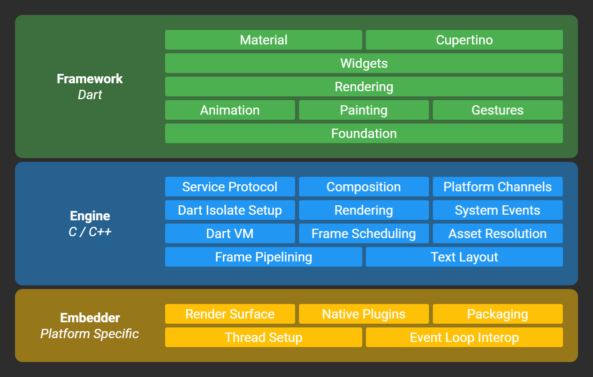

# 01.1 - Giới thiệu Flutter

Chào mừng bạn tới với Fx Studio. Chúng ta sẽ tìm hiểu về khái niểm Flutter trước tiên. Nó là gì & làm được gì. Nhưng gì cần chuẩn bị để có thể phát triển ứng dụng với Flutter ... Bài viết sẽ mang tính lý thuyết và khá nhàm chán.

> Bạn có thể bỏ qua phần này để bắt đầu với việc coding cũng không sao.

## Flutter là gì?

Nếu bạn là dev và bạn ít cập nhật thông tin công nghệ, thì rất có thể bạn đã nghe bạn bè của bạn nhắc tới `Flutter` một hoặc vài lần. Vậy, **Flutter là gì?**

> Hiểu đơn giản nhất, **Flutter** là một bộ công cụ để phát triển phần mềm của Google, với mục đích xây dựng các ứng dụng **cross-platform**.

Và cũng có nhiều bạn xem Flutter là người em của Android. Thì điều này hơn sai nhoé. Flutter cung cấp cho bạn giải pháp để phát triển ứng dụng cho cả iOS & Android. Bên cạnh đó còn có khả năng phát triển cho web và desktop nữa ... Bây giờ hoặc tương lai gần sắp tới thì Flutter có vẻ là chúa cmnr.

> Vấn đề, đây là giải pháp đơn giản nhất để ứng dụng chạy được trên đa nền tảng & hiệu năng như native.

Flutter không phải là ngôn ngữ lập trình. Nó sử dụng Dart làm ngôn ngữ của mình và Dart cũng như Kotlin, Swift, Java hay Typescript ... cũng mang trong mình các tính chất cơ bản & phổ thông của một ngôn ngữ lập trình hiện đại.

Bạn có thể biên dịch Dart thành native code, từ đó cải thiện hiệu năng chương trình. Ngoài ra chúng còn tính năng đặt biệt là `hot reload`. Bạn sẽ tìm hiểu nó sau nhoé.

Trong nhiều năm, các lập trình viên đã được hứa hẹn về khả năng **viết một lần và chạy ở mọi nơi**. Flutter có thể là nỗ lực tốt nhất để đạt được mục tiêu đó.

## Đối tượng

Có thể nói đây xem là nền tảng lập trình quốc dân. Khi bất kì ai với bất kì mục đích gì thì cũng có thể tự tin học Flutter được hết.

* Đối với các bạn sinh viên chuẩn bị bước vào đời. Flutter sẽ là sự lựa chọn số 1. Vì đột `hot` của nó và cộng động càng ngày càng lớn, nên tài liệu học tập sẽ nhiều. Cũng như thị trường việc làm cho Flutter cũng khá là sôi nỗi.
* Đối với các bạn làm việc đã lâu với một nền tảng, thì đây là cơ hội cho bạn đổi mới công nghệ bản thân. Bạn có thể sử dụng lại toàn bộ kiến thức của mình vào Flutter & Dart. Mình nghĩ bạn sẽ không tốn thời gian quá nhiều để nắm bắt được Flutter đâu.
* Đối với các bạn muốn chuyển đổi nền tảng. Thì bạn sẽ tiết kiệm cho mình khá nhiều thời gian và công sức bỏ ra. Khi đó bạn có thể tự gọi mình là **Full platform Developer** nhoé.
* Đối với các bạn đang làm web (FE & BE), bạn sẽ có được trải nghiệm làm app mobile xịn sò. Nhưng bạn sẽ là những đối tượng gặp khó khăn nhiều nhất. Do nền tảng mobile của web nó khác nhau rất lớn.
* Đối với các bạn mobile (iOS & Android) thì như hổ thêm cánh. Đây là cách tốt nhất để cho bạn bước ra khỏi vùng an toàn của mình.

> Và mình đang là một iOS Developer nhoé!

## Flutter có những gì?

* **Open-source**. Điều đó có nghĩa là bạn có thể theo dõi sự phát triển của nó và biết điều gì sắp xảy ra và thậm chí dùng thử các tính năng mới đang được phát triển. Bạn có thể đóng góp công sức của mình cho cả cộng đồng.
* **Dart** programming language. Một ngôn ngữ lập trình bậc cao được ra đời sau. Kế thừa lại tất cả tinh hoa của những ngôn ngữ khác.
* **Hot reload**. Đây là thứ mà biết bao dev mobile ao ước. Bạn sẽ không tốn thời gian chờ build lại ứng dụng để test. Kèm với đó là **Hot restart** khi bạn không kiểm soát hết giá trị/trạng thái của các biến trong ứng dụng. Vẫn đem lại trải nghiệm tốt hơn là **full restart**.
* **Cross-platform toolkits**. Đây chính là thứ mà mình thích ở Flutter. Bạn sẽ được cung cấp đầy đủ các công cụ cho phát triển ứng dụng đa nền tảng. Điển hình như: Google’s Material Design và Cupertino widgets (iOS)
* **Composable**. Điều bất ngờ nữa là khi mình thử nghiệm kết hợp **animations & transitions**. Hiệu năng khá là tốt, đem lại trải nghiệm không tưởng khi đây là một cross-platform.
* **Widgets**. Mọi thứ điều là widgets, bạn xây dựng ứng dụng như lắp ráp lego vậy. Ngoài ra, các widgets sẽ tự động cập nhật dữ liệu khi có sự thay đổi nữa. Nhức nách!
* **Platform integration**. Điểm lợi hại nữa chính là khả năng tương tác với các nền tảng với Flutter. Bạn có thể tái sử dụng các thư viện trên các nền tảng khác cho Flutter. Flutter còn hỗ trợ thêm C/C++, do đó có khả năng tương tác với Java (Android) & Objective-C (iOS).
* **Declarative Development**. Bạn sẽ gia nhập vào gia đình Declarative Developemt cùng với các nền tảng tiềm năng khác như là **SwiftUI** (Apple) & **Jetpack Compose** (Google).

## Khi nào bạn không nên dùng Flutter

Mặc dù, Flutter rất tốt. Nhưng đôi lúc thì phải rất tiếc. Những trường hợp sau đây thì bạn không nên dùng Flutter nhoé.

* **Games and audio**
  * Đây là cả một vũ trụ khác rồi. Bạn có thể tạo ra các trò chơi đơn giản với Flutter. Tuy nhiên, khi game của bạn phức tạp hơn thì bạn nên tìm tới các nền tảng game khác. Như: Unity, Unreal ...
  * Với âm thanh thì Flutter chưa có hỗ trợ nhiều. Do đó, nên bạn làm một ứng dụng phát nhạc thì rất là vất vả. Hiệu năng cũng không tốt.
* **Apps with specific native SDK needs**
  * Điều hiển nhiên. Khi bạn cần ứng dụng tương tác đặc biệt với thiết bị. Thì các nền tảng native là số 1. Và tương lai có ra sao nữa thì với Swift, Kotlin vẫn là những tượng đài không thể sụp đổ được.
  * Ví dụ: ứng dụng của bạn cần tương tác với hệ sinh thái của Apple với CloudKit, native hardware, MLKit, StoreKit ... thì SwiftUI sẽ là lựa chọn tốt hơn rất nhiều.
* **Certain platforms**
  * Flutter không chạy ở khắp mọi nơi. Nó chưa hỗ trợ Apple Bitcode, có nghĩa là nó không hỗ trợ watchOS, tvOS hoặc một số tiện ích mở rộng ứng dụng iOS nhất định.
  * Hỗ trợ của nó cho web vẫn là **beta** hoặc có thể là mới **release**, điều đó có nghĩa là Flutter có nhiều tính năng và cải tiến hiệu suất trước nó, nhưng chúng sẽ sắp ra mắt.

## **Flutter architecture**

Flutter có kiến trúc thiết kế theo kiểu mô-đun và nhiều lớp kết hợp. Giúp bạn chỉ cần viết logic một lần và hoạt động đồng nhất trên các nền tảng khác nhau. Ta thử tìm hiểu nhanh qua chúng có những gì nhoé.

* **Framework** là lớp đầu tiên mà bạn sẽ tiếp xúc. Nó được viết bằng Dart và chứa các thư viện **high-level** mà bạn sẽ dùng trực tiếp để phát triển ứng dụng. Nó bao gồm: UI theme, widgets, layout and animations, gestures và foundational building blocks ... Và các **plugins** cũng **high-level**, như: JSON serialization, geolocation, camera access, in-app payments ... Với **plugins** thì khi nào bạn cần tới nó thì bạn sẽ phải tự thêm vào.
* **Engine** là phần lõi (core) là các phần được viết với **C++** và là các phần nguyên thuỷ của Flutter. Đó là các thư viện low-level, ví dụ như: Flutter API, such as I/O, graphics, text layout, accessibility, the plugin architecture và the Dart runtime ... Và **Engine** phụ trách việc render lên màn hình.
* **Embedder** khác nhau đối với từng nền tảng mục tiêu và xử lý đóng gói mã dưới dạng một ứng dụng độc lập hoặc mô-đun nhúng.

Mỗi lớp kiến trúc được tạo thành từ các lớp con và mô-đun khác nhau trong đó. Và dành cho các bạn mới bắt đầu thì chúng ta sẽ làm việc với lớp **Framework** khá nhiều nhoé.

## Flutter Framework

Chỉ là liệt kê vài thành phần mà bạn sẽ sử dụng nhiều thôi:

* **UI Theme** bao gồm Material (Android) or Cupertino (iOS) design language. Bạn sẽ có các UI Control tương tự với 2 nền tảng lớn đó. Tiết kiện thời gian lập trình đi rất nhiết. Ngoài ra, số lượng UI Control cũng khá lớn, bạn tha hồ mà sử dụng.
* **Widget layer**. Đây là nơi bạn soạn các yếu tố thiết kế và tương tác để tạo nên ứng dụng.
* **Rendering layer**. Là phần trừu tượng để xây dựng một bố cục.
* **Foundation layer**.Lớp nền tảng cung cấp các khối xây dựng cơ bản, như hoạt ảnh và cử chỉ, tạo nên các lớp cao hơn.
* ...

## Tạm kết

Toàn là chữ thôi, chủ yếu cho bạn biết thêm vài thông tin về Flutter, nền tảng mà bạn chọn để bắt đầu cuộc phiêu lưu mới. Bạn có thể tìm thêm các thông tin khác về Flutter, để hiểu hơn về nó. Ví dụ như như các ưu nhược điểm, lý do tại sao bạn chọn Flutter so với các nền tảng cross-platform khác ... Tuy nhiên, chúng khá là dư thừa và cũng như bài viết này vậy. Ahihi!

---

Cảm ơn bạn đã theo dõi các bài viết từ **Fx Studio** & hãy truy cập [website](https://fxstudio.dev/) để cập nhật nhiều hơn!
