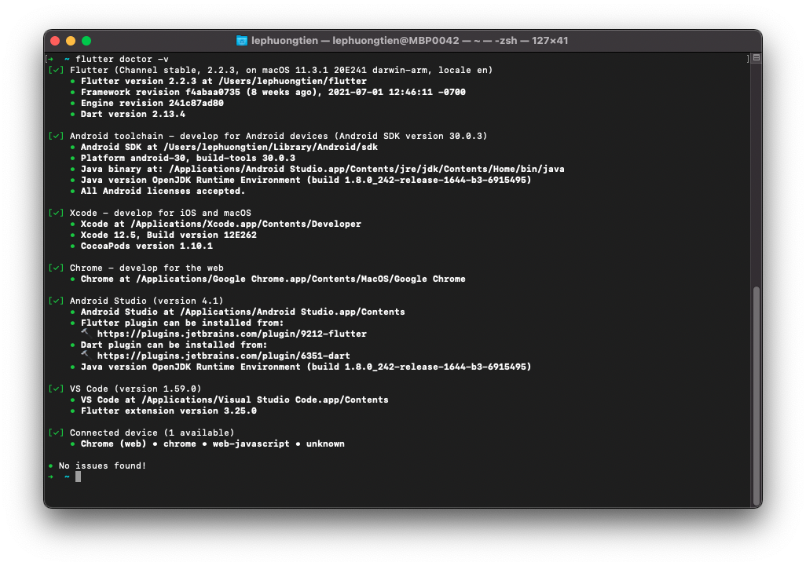
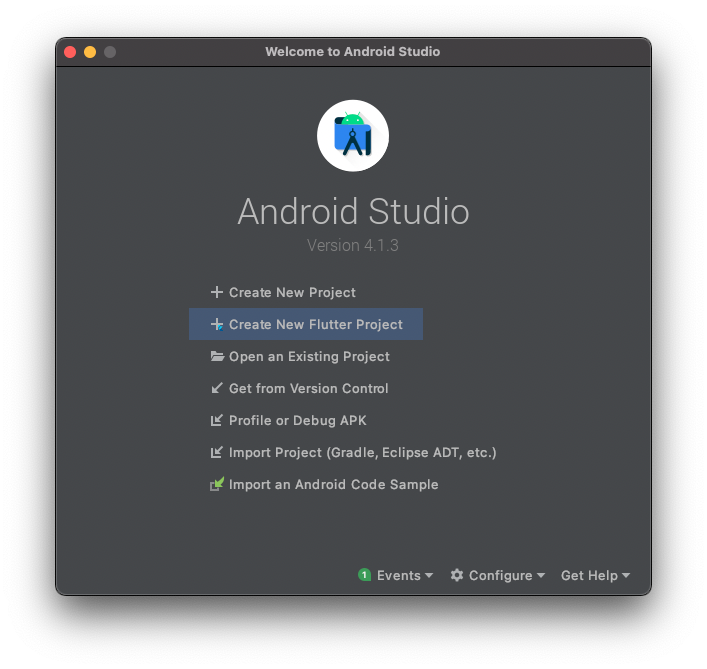
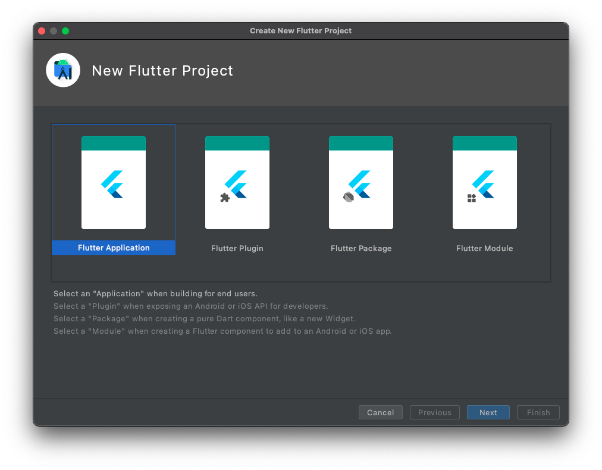
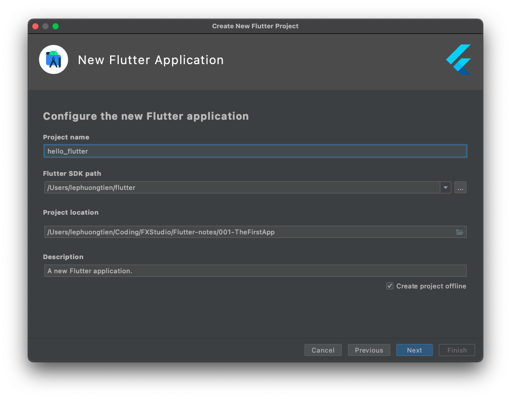
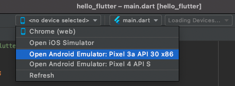
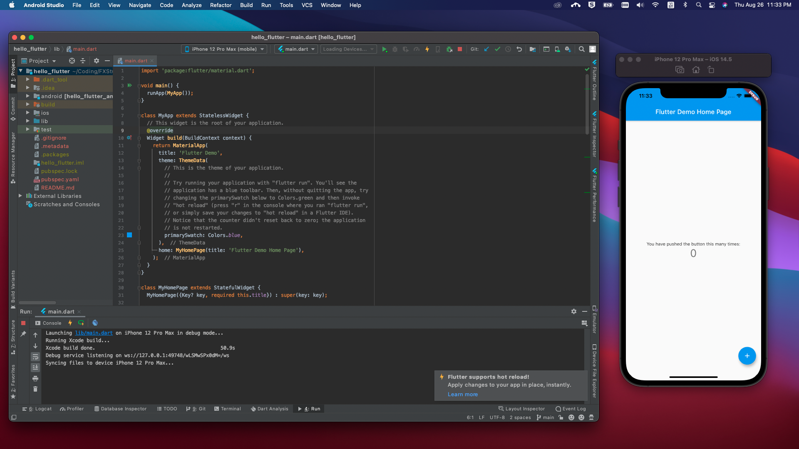
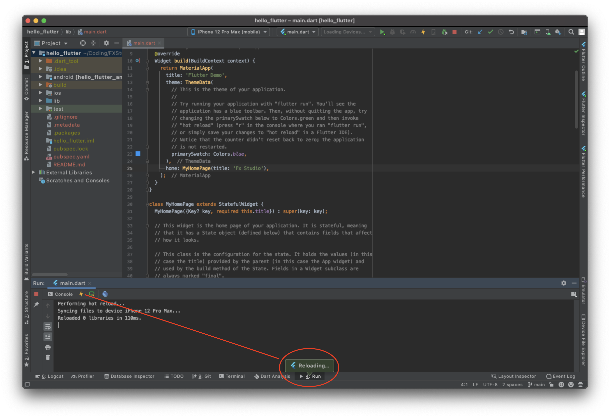

# 01.2 - Cài đặt

Chào mừng bạn đến với **Fx Studo**. Ở bài viết trước, ta được làm quen với **Flutter** với các khái niệm liên quan với nó. Bây giờ, bạn sẽ thực hiện cài đặt **Flutter** và **Hello world** nhoé.

Vì chưa có gì để lo lắng hết, nên ...

> Bắt đầu thôi!

## Cài đặt SDK

Chắc phần này, mình suy nghĩ cũng khá là dư thừa. Vì trên mạng đã có vô vàng tài liệu hướng dẫn rồi. Về Flutter, bạn sẽ rất thoải mái khi chúng tương tích với khá nhiều hệ điều hành bây giờ. Như: Windows, macOS, Linux, Chrome OS. Do đó, bạn cũng hãy lựa chọn cách cài đặt phù hợp.

> Trong chuỗi bài viết này, mình sẽ sử dụng **macOS** là môi trường phát triển cho các ứng dụng Flutter của mình.

### Yêu cầu hệ thống

- **Operating Systems**: macOS (64-bit)
- **Disk Space**: 2.8 GB (does not include disk space for IDE/tools).
- **Tools**: Flutter uses `git` for installation and upgrade. We recommend installing [Xcode](https://developer.apple.com/xcode/), which includes `git`, but you can also [install `git` separately](https://git-scm.com/download/mac).

### Cài đặt

* Đầu tiên bạn truy cập vào trang web chính thức của của Flutter là : https://flutter.dev/
* Tới phần [Get the Flutter SDK](https://flutter.dev/docs/get-started/install/macos)
* Tải SDK, bạn có 2 cách
  * Download trực tiếp từ trang chủ ([SDK releases](https://flutter.dev/docs/development/tools/sdk/releases)). Đây là phiên bản Stable
  * Clone từ GitHub

```shell
 git clone https://github.com/flutter/flutter.git -b stable
```

* Bạn sẽ chuẩn bị 1 thư mục để chứ SDK download về. Đó chính là thư mục SDK chính của bạn. Bạn hãy ghi nhớ `path` tới thư mục nhoé
* Bạn chi chuyển về thư mục đó bằng lệnh `cd` ở Terminal
* Bạn sẽ lấy `path` của thư mục sdk này. Tiếp tục với Terminal

```shell
export PATH="$PATH:`pwd`/flutter/bin"
```


### Update your Path

Đây là phần các bạn mới học sẽ bỏ qua. Bạn cần `path` tới thư mục SDK ở mọi nơi, khi bạn muốn là gì đó với Flutter hay Dart. Hiểu nôm na

> Tạo biến môi trường cho PATH của bạn tới thư mục chứa SDK Flutter

Bước này cũng khá mơ hồ với các bạn mới hoặc các bạn chưa bao giờ vọc `shell`.

* Bạn sẽ tìm cách tạo một file **.bashrc**  hoặc bash_profile . Nôm na là file **bash** nhoé. Tuỳ thuộc vào `shell` của bạn đang dùng là gì thì sẽ có cách tạo khác nhau. Và phần trăm lớn là đã có sẵn trong máy của bạn rồi.
* Bạn mở file ẩn của hệ điều hành lên, tìm tới thư mục **home** hay user của bạn trong hệ điều hành. Và tìm xem có file này không
  * $HOME/.bash_profile
  * $HOME/.bashrc
  * $HOME/.zshrc
* Nếu có thì khoẻ rồi, file nào cũng được. Nếu không có thì lên google tìm cách dùng lệnh tạo nhoé
* Bạn mở file đó lên bằng **TextEdit** và tiến hành thêm dòng lệnh nào vào trong file đó

```shell
 export PATH="$PATH:[PATH_OF_FLUTTER_GIT_DIRECTORY]/bin"
```

`[PATH_OF_FLUTTER_GIT_DIRECTORY]` chính là cái đường dẫn mà mình nói bạn cần chú ý ở trên kìa.

Muốn test `path` có hoạt động được hay không. Thì bạn mở Terminal lên ở bất cứ thư mục nào vào gõ lệnh `flutter help`. Khi đó là bạn sẽ biết được cài đặt thành công hay không rồi. Chúc bạn may mắn!

### Doctor

Để check hệ thống máy của bạn & các tools liên quan nữa. Bạn mở Terminal lên và chạy lệnh `flutter doctor` hoặc `flutter doctor -v` để kiểm tra.

Flutter sẽ kiểm tra trong máy tính của bạn, nếu còn thiếu gì thì nó sẽ báo và hướng dẫn bạn cài đặt thêm. Phần này, bạn tự xử lý nhoé. Còn nếu thành công thì sẽ trông như thế này nè.



## Tools & IDE

### IDE

Bạn sẽ có một vài gương mặt điển hình như sau:

**Tools**

- Xcode
- Cocoapod
- Android Studio
- Android toolchain

**Editor**

- Android Studio
- Visual Studio Code
- Emacs

Tuy nhiên, để bạn khỏi phân vân thì hãy chọn

> Android Studio

Vì nó là lựa chọn tốt ưu nhất cho bạn. Bạn sẽ có Emulator để test với Android và Editor hàng chính chủ của Google. Hỗ trợ bạn tới tận răng.

### Plugin

Bạn cũng cần phải thêm các Plugin cho Android Studio để bạn có thể tạo được Project Flutter. Các bước như sau:

* Mở **Android Studio**
* Mở **Preferences > Plugins**
* Tìm hoặc chọn **Flutter** và bấm **install**
* Nếu có báo cài luôn Dart Plugin thì bạn cũng cài thêm nhoé
* **Restart** lại Android Studio

Nếu bạn thấy có mục chọn `Create New Flutter Project` thì là thành công nhoé!



## Hello world

Cũng như biết bao lần bắt đầu học một thứ lập trình mới. Bạn sẽ bắt đầu với việc **Hello world**.

### Create Flutter Project

Bạn mở Android Studio và tiến hành tạo mới một Project với Flutter nhoé. Chúng ta sẽ chọn **Flutter Application**.



Nhấn **Next** và sang bước tiếp theo. Bạn sẽ điền đầy đủ thông tin cho Project nhoé

* **Project Name** : tên của project. Chú ý với dấu `_` , nó được khuyến khích trong cách đặt tên của Flutter & Dart
* **Flutter SDK path** : là đường dẫn tới thư mục chứa SDK nhoé
* **Project location** : nơi chứa project
* **Description** : mô tả project của bạn



Tiếp tục nhấn **Next** để sang bước cuối cùng. Bạn sẽ điền **Package name**. Nó cũng là Bundle ID ban đầu cho Project. Và có thể chỉnh sửa về sau được, nên không cần lo lắng nhiều về nó.


Bấm **Finish** để hoàn thành việc tạo mới một Flutter Project.

### Device

Để có thể build được project thì bạn cần phải kết nối với thiết bị, thật hoặc giả đều được. Trong ví dụ này, chúng ta chưa cần kết nối với thiết bị thật. Thay vào đó bạn sẽ sử dụng các máu ảo.



* Với Android, bạn sử dụng Emulator
* Với iOS, bạn sử dụng Simulator

> Nếu bạn chưa tạo ra chúng hoặc chưa cài đặt thì có thể vài đường Google là xong được nhoé.

Mình là dev iOS thì sẽ chọn Simulator, vì nó quen thuộc và chạy nhanh hơn máy ảo Emulator của Android rất nhiều. Sau khi, máy ảo đã xuất hiện thì bạn hãy bấm **Run** để thực thi project đầu tiên nhoé.

> Lần build đầu tiên sẽ lâu một chút. Bạn chịu khó chờ nhoé



Kết quả như thế này là đã thành công rồi nhoé. Bạn thử nhấn vào button `+` để xem chúng nó kì diệu ra sao. Ahihi!

### Hot reload

Ta sẽ tử một chức năng được quảng cáo nhiều nhất là **Hot reload**, xem thực hư có đúng như lời đồn không nhoé.

Bạn chọn file `main.dart` và tìm tới dòng lệnh sau:

```dart
home: MyHomePage(title: 'Flutter Demo Home Page'),
```

Sau đó, bạn nhanh tay đổi thành

```dart
home: MyHomePage(title: 'Fx Studio'),
```

Tiếp theo, bạn nhấm `Command + S` và điều kì diệu sẽ xảy ra.



Ngay lập tức, chức năng **Hot reload** sẽ thực hiện nhiệm vụ của mình. Ứng dụng của bạn không cần phải build lại từ đầu. Các phần thay đổi sẽ tự động cập nhật lên ứng dụng. Như trong ví dụ thì xảy ra trong vòng `110ms` mà thôi. Khá là nhanh.


Kết quả hiển thị cũng đẹp và mượt nữa. Ahihi!

### Command Line

Ngoài ra, bạn có thể dùng các lệnh Command Line để tạo Flutter Project. Đầu tiên, bạn mở Terminal và `cd` tới thư mục cần tạo.

* Tạo project

```shell
 flutter create my_app
```

* Mở Simulator hoặc Emulator hoặc cắm thiết bị thật vào máy tính
* Chạy project

```shell
flutter run
```

Như vậy là xong. Nhưng mà bí quá thì mới dùng thôi nhoé. Chứ mình vẫn là người chơi hệ kéo thả.

## Tạm kết

* Cài đặt Flutter SDK
* Cài đặt IDE cho Flutter
* Tạo project để Hello world với Flutter

---

Cảm ơn bạn đã theo dõi các bài viết từ **Fx Studio** & hãy truy cập [website](https://fxstudio.dev/) để cập nhật nhiều hơn!
