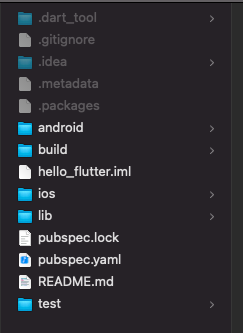
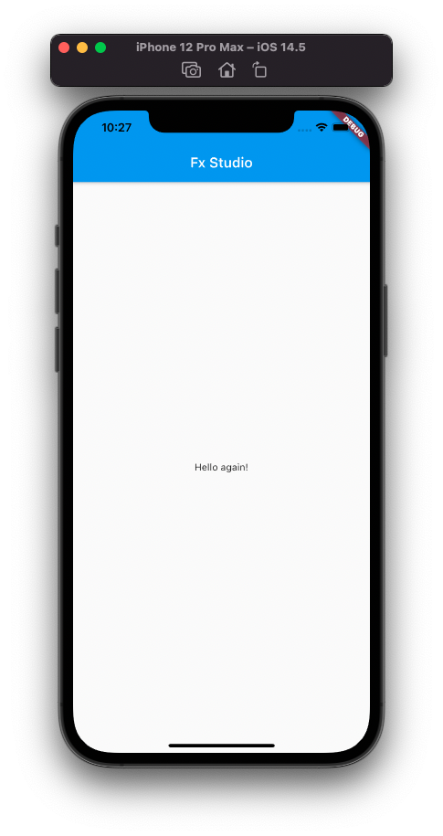
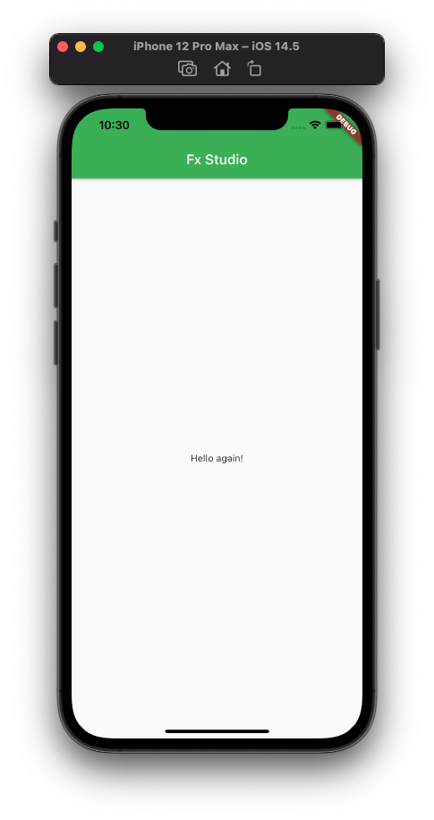
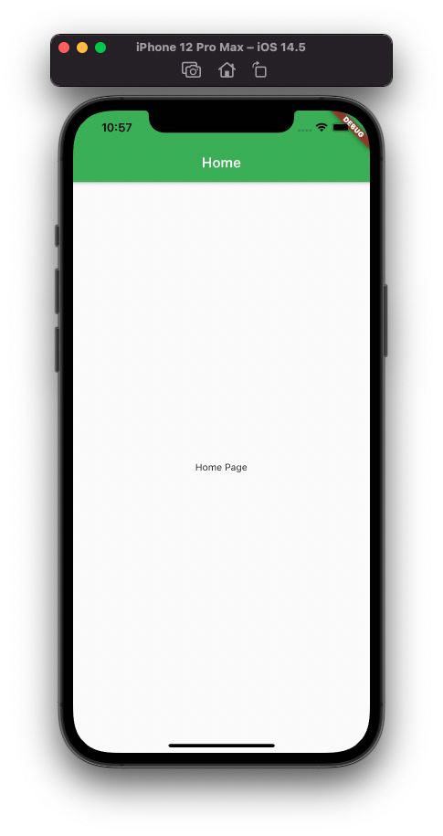
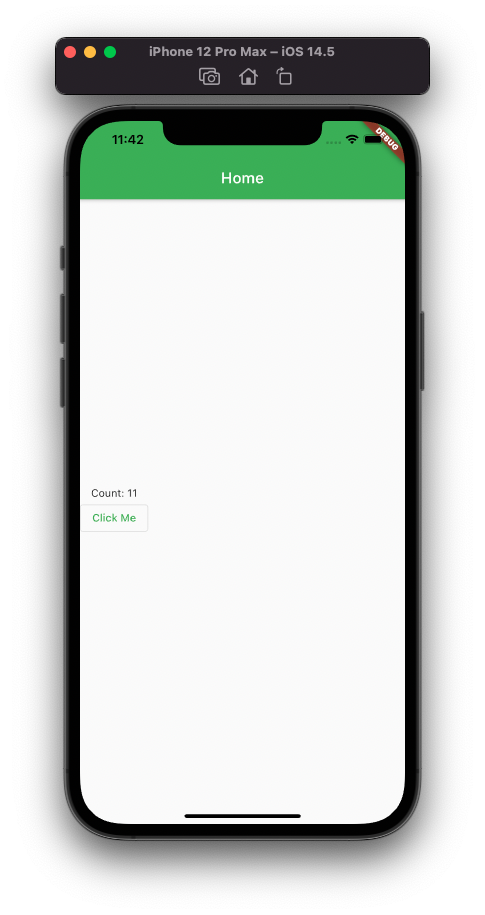

# 01.3 - The First Flutter App

Chào bạn đến với **Fx Studio**. Chúng ta đã tìm hiểu về Flutter và cài đặt được SDK để có thể code rồi. Bài viết này sẽ giúp bạn tạo một ứng dụng đơn giản nhất. Mục đích đem lại cho bạn cái nhìn tổng quan về ứng dụng Flutter trước. Sau đó, chúng ta mới tìm hiểu các thành phần trong ứng dụng hay cấu thành giao diện của Flutter. Chủ đề là **The First App**.

Nếu mọi việc đã ổn rồi, thì ...

> Bắt đầu thôi!

## New Project

Chúng ta sẽ tạo mới một Project hoặc bạn có thể dùng lại Project từ bài trước cũng được. Mình tóm tắt lại cho bạn là chúng ta có 2 cách tạo project Flutter là:

* Android Studio (hay Visual Studio Code), giao diện trực quan
* Command Line với cách dùng lệnh để tạo

> Mình sẽ dùng lại Project `hello_flutter` ở bài trước. Cho tiết kiệm nhoé.

### Project structure

Trước tiên, bạn cần biết về cấu trúc một Project Flutter bao gồm những gì trước đã.



Đâu tiên, bạn chưa cần quan tâm tới các file ẩn nhoé. Chúng ta sẽ tìm hiểu nó ở các chương sau cùng của series này.

Ở đây sẽ chứa rất nhiều các file, nhưng trong khuôn khổ bài viết, chúng ta chỉ cần chú ý đến các file sau :

- **android** / **ios** : 2 folder này sẽ chứa **code native**. Trong khi làm việc, chúng ta sẽ nhận thấy khó vài trường hợp **Flutter** không thể giải quyết tất cả các bài toàn mà phải nhờ đến **native code**.
  - Có thể xem đó là 2 project cho Android và iOS mà Flutter sinh ra cho bạn.
  - Ví dụ như iOS thì bạn dùng nó để submit app lên store
  - Ta sẽ sử dụng ở sau này thôi, tạm thời biết vậy là ổn rồi
- **lib**: đây là folder chính chúng ta sẽ làm việc, nơi này sẽ chứa gần như tất cả source code của 1 project flutter sẽ gồm các file source dart, các pakage.
- **test**: nơi chúng ta tạo ra các unit-test case.
- **pubspec.yaml** : file này là nơi khai báo các thư viện, config hệ thống,... Nếu các các bạn đã từng làm việc với native Android thì nó sẽ tương tự như file gradle.
- Ngoài ra khi làm chúng ta có thể tạo thêm file như **assets** để chứa các resource như ảnh, icon, ...

### Main

Khi đã nắm được về cấu trúc của một project Flutter rồi. Chúng ta thử tuỳ biến code xem sao. Bạn mở file `main.dart` và xem từ trên xuống nhoé.

Đâu tiên là đoạn code này

```dart
void main() {
  runApp(MyApp());
}
```

Không cần quá suy nghĩ nhiều thì đích thị đây là hàm `main` và nó sẽ là hàm đầu tiên được chạy trong project. Trong hàm `main`, bạn sẽ thấy dòng lệnh duy nhất là `runApp` và một đối tượng `MyApp()` được truyền vào.

Bằng kinh nghiệm lập trình 10 mấy năm của mình thì suy luận rằng.

> **MyApp** chính là ứng dụng của chúng ta rồi.

Và chúng ta có thể tạo thêm các lớp khác tương tự như **MyApp**. Để làm nhiệm vụ như **MyApp** đang làm.

### MyApp

Ta tiếp tục xem code của **MyApp** như thế nào.

```dart
class MyApp extends StatelessWidget {
  // This widget is the root of your application.
  @override
  Widget build(BuildContext context) {
    return MaterialApp(
      title: 'Flutter Demo',
      theme: ThemeData(
        // This is the theme of your application.
        //
        // Try running your application with "flutter run". You'll see the
        // application has a blue toolbar. Then, without quitting the app, try
        // changing the primarySwatch below to Colors.green and then invoke
        // "hot reload" (press "r" in the console where you ran "flutter run",
        // or simply save your changes to "hot reload" in a Flutter IDE).
        // Notice that the counter didn't reset back to zero; the application
        // is not restarted.
        primarySwatch: Colors.blue,
      ),
      home: MyHomePage(title: 'Fx Studio'),
    );
  }
}
```

Trong đó:

* MyApp kế thừa (`extends`) từ **StatelessWidget**, chứ không phải một thể loại App nào đó.
* Bản thân nó đang `returen` về **MaterialApp**. À há, đuôi con thằn lằn là đây rồi.
* Bỏ qua các phần râu ria, tập trung vào `home` của **MaterialApp**. Nó đang lại khởi tạo một đối tượng là **MyHomePage**

Bằng suy luận thì chúng ta nhanh chóng hiểu được rằng

* **MyApp** không quan trọng
* Có 2 thứ làm MyApp quan trọng đó là **StatelessWidget** & **MaterialApp**
* Có vẻ **MaterialApp** là đối tượng chính của ta cần phải phân tích

Và mọi thứ giống như bạn đang chơi lắp ráp lego vậy. Thực thể được lắp ráp là **Widget**, nó được xem là trái tim của toàn bộ giao diện.  

> **StatelessWidget** là một widget sẽ không thay đổi nội dung của nó sau khi khởi chạy ứng dụng.

**MaterialApp** là container chứa toàn bộ ứng dụng. Chúng ta sẽ có nhiều màn hình khác nhau, nên ta có thể tạo thêm nhiều page tương tự như **MyHomePage** để thay thế.

## Hello again!

Bạn đã nắm được cấu trúc project và các thành phần cơ bản cấu thành nên ứng dụng Flutter rồi. Tuy nhiên, code sinh ra quá nhiều và nhìn rối mắt quá. Ta sẽ làm màu nó lại. 

Bước đầu tiên, bạn xoá toàn bộ code trong file `main.dart` nhoé. Tiếp theo, bạn thêm đoạn code này vào.

```dart
import 'package:flutter/material.dart';

void main() => runApp(MyApp());

class MyApp extends StatelessWidget {
  @override
  Widget build(BuildContext context) {
    return MaterialApp(
      title: 'Welcome to Flutter',
      home: Scaffold(
        appBar: AppBar(
          title: Text('Fx Studio'),
        ),
        body: Center(
          child: Text('Hello again!'),
        ),
      ),
    );
  }
}
```

Đây chính là phiên bản thu gọn lại của **Hello world** nhoé. Với nó thì bạn sẽ dễ hiểu hơn nhiều.

Trong đó:

* Vì hàm `main` chỉ có 1 dòng lệnh nên ta dùng cú pháp thu gọn của function với toán tử `=>`
* Vẫn khởi tạo đối tượng **MyApp**
* Thay vì `home` cần có 1 Page nào đó, ta sẽ dùng 1 widgets là **Scaffold**. Nó cũng là thành phần cấu tạo chính của một Page nào đó trong project.
* **Scaffold** cung cấp cho ta
  * Một `appBar` tương tự như NavigationBar trong iOS
  * Bạn có thể xét lại `title` của AppBar
  * `body` là nội dung hiển thị chính.
  * Tạo 1 widget là **Center** & 1 **Text**. Nó sẽ hiển thị dòng chữ `Hello again!` ở chính giữa màn hình.

Hãy build project và cảm nhận kết quả nhoé!



Bạn thử thay đổi thêm code của chúng ta như sau:

```dart
class MyApp extends StatelessWidget {
  @override
  Widget build(BuildContext context) {
    return MaterialApp(
      title: 'Welcome to Flutter',
      theme: ThemeData(
        primarySwatch: Colors.green,
      ),
      home: Scaffold(
        // .....
      ),
    );
  }
}
```

Trong đó:

* `theme` được thêm vào **MaterialApp** với đối tượng **ThemeData**
* Chúng ta chọn màu là `Colors.green`

Bạn không cần build lại project mà chỉ cần nhấn vào nút **Hot Restart**. Ứng dụng nhanh chóng được cập nhật lại toàn bộ. Tiết kiệm thời gian build app nhoé.



## New Page

Mình sẽ dùng hậu tố **Page** cho các màn hình trong Flutter Project. Vì cũng dùng theo cách đặt tên của Flutter trong mẫu ví dụ là **MyHomePage**.

Một điều hiển nhiên là bạn không thể nhét hết tất cả vào trong 1 file như `main.dart` rồi. Do đó, ta sẽ tạo một file mới để chưa một **Page** mới. Chúng ta sẽ có 2 cách tạo 1 Page theo 2 kiểu mục đích sử dụng.

### Stateless Widget

Bạn tạo một file với tên là `home_page.dart` tại thư mục **lib** trong project nhoé. Sau đó, ta sẽ bắt đầu thêm code cho màn hình đầu tiên. Tham khảo ví dụ code sau:

```dart
import 'package:flutter/material.dart';

class HomePage extends StatelessWidget {
  @override
  Widget build(BuildContext context) {
    return new Scaffold(
      appBar: AppBar(
        title: Text("Home"),
      ),
      body: new Center(
        child: Text("Home Page"),
      ),
    );
  }
}
```

Vì HomePage mới chúng ta sẽ không có thay đổi gì nội dung (tức hiển thị tĩnh) thì ta sẽ `extends` với **StatelessWidget**. Khi bạn kế thừa **StatelessWidget**, thì bạn cần `override` lại hàm `build`.

* Tham số `context` và kiểu dữ liệu **BuildContext** ta sẽ tìm hiểu sau nhoé.

Tại hàm `build`, chúng ta `return` về một đối tượng **Scaffold**.

> **Scaffold** cho phép chúng ta triển khai các widget ứng dụng chuẩn material mà hầu hết các ứng dụng đều có. Chẳng hạn như *AppBar, BottomAppBar, FloatingActionButton, BottomSheet, Drawer, Snackbar*...  **Scaffold** được thiết kế để trở thành vùng chứa cấp cao nhất cho **MaterialApp** mặc dù không cần thiết phải lồng một **Scaffold**.

Tại **Scaffold**, bạn chỉ cần khai báo các tham số cần thiết sau:

* `title`
* `body`

Cuối cùng, bạn cập nhât lại ở file `main.dart` nha. Để đứa đối tượng **HomePage()** vào. Tham khảo code nha:

```dart
class MyApp extends StatelessWidget {
  @override
  Widget build(BuildContext context) {
    return MaterialApp(
      title: 'Welcome to Flutter',
      theme: ThemeData(
        primarySwatch: Colors.green,
      ),
      home: HomePage()
    );
  }
}
```

Chú ý mỗi `home` cảu MaterialApp thôi nhoé, Bạn bấm lại **Hot restart** và cảm nhận kết quả!



### Stateful Widget

Đây là cách thứ 2 để bạn tạo một màn hình hay page với nội dung thay đổi được trong thời gian ứng dụng hoạt động. Thay vì bạn kế thừa **StatelessWidget**, thì bạn sẽ kế thừa **StatefulWidget**. Nhưng sẽ có một số điểm khác nhau.

#### Create

Bắt đầu, bạn sẽ tạo một file là `counter_page.dart` nhoé. Một **StatefulWidget** có một chút khác biệt so với **StatelessWidget**. Nó gồm hai class: 

*  `State` object 
* `widget` chính. 

Mục đích của class này là duy trì *state* khi Flutter re-render các widget. Ở đây, sẽ có bạn nhầm lẫn cho rằng **State** là trạng thái của các biến. Nhưng thực tế **State** là trạng thái của cả 1 **widget**. 

```dart
class CounterPage extends StatefulWidget {
  
}

class _CounterPageState extends State<CounterPage> {
  
}
```

Ta có ví dụ cho **CounterPage** với **StatefulWidget** nhoé. Với

* **CounterPage** là widget
* **_CounterPageState** là State

> Sử dụng tiền tố `_`  của **State** thì để xem nó là sở hữu riêng của **StatefulWidget** mà thôi.

#### Override

Chúng ta sẽ cần phải viết thêm các phương thước cần thiết cho 2 class trên. Với:

* **StatefulWidget** thì cần `createState` để tạo đối tượng **State**
* **State<>** thì cần `build` để tạo các Widget và quản lý các trạng thái dữ liệu

Xem code ví dụ nhoé

````dart
class CounterPage extends StatefulWidget {
  @override
  State<StatefulWidget> createState() {
    return new _CounterPageState();
  }
}

class _CounterPageState extends State<CounterPage> {
  
  @override
  Widget build(BuildContext context) {
    return new Scaffold(
        appBar: AppBar(
          title: Text("Home"),
        ),
        body: new Column(
          crossAxisAlignment: CrossAxisAlignment.center,
          mainAxisAlignment: MainAxisAlignment.center,
          children: [
            Text("Ahihi!"),
            OutlinedButton(
              onPressed: () {
                print('Received click');
              },
              child: const Text('Click Me'),
            )
          ],
        ));
  }
}
````

Tiện thể, mình bổ sung thêm giao diện cho State bao gồm như sau:

* **Scaffold** tương tự với cách dùng **StatelessWidget**
* Tại `body` của **Scaffold**, tạo mới 1 Column. Chúng là 1 bố cụ layout, bạn sẽ tìm hiểu sau nhoé
* **Column** là 1 container, nên nó có thể chứa nhiều widget khác. Chúng sẽ được khai báo vào `children`, một Array Widget.
* Trong đó, ta có 1 **Text** và 1 **Button**. Nội dung của 2 widget này khá đơn giản. Ta chỉ cần quan tâm tới `onPressed` là được.

#### Update State

Điều quan trọng là việc bạn thay đổi được nội dung hiển thi của màn hình với **StatefulWidget** nhoé. Trước tiên, bạn cần có một thuộc tính để lưu trữ dữ liệu. Bạn khai báo như sau vào lớp State nhoé

```dart
var count = 0;
```

Ta có một biến Int là `count`. Tiếp theo, ta sẽ hiển thị nó lên **Text**. Bạn chỉnh sửa lại Text như sau:

```dart
Text("Count: $count"),
```

Cuối cùng, ta sẽ cập nhật giá trị tại `onPressed` của Button. Bạn tham khảo tiếp nhoé

```dart
            OutlinedButton(
              onPressed: () {
                print('Received click');
                setState(() {
                  count += 1;
                });
              },
              child: const Text('Click Me'),
            )
```

Với việc gọi hàm `setState()` trong đó với nội dung là thay đổi giá trị của thuộc tính. Thì các phần giao diện nào liên quan tới thuộc tính đó sẽ được `render` lại. Tức là được cập nhật lại về mặt nội dung.

> Tương tự như SwiftUI, nhưng ta phải cần thêm hàm `setState()` để cập nhật giá trị.

Tóm lại, khi người dùng kích vào **Button**. Giá trị của `count` sẽ tăng lên 1 đơn vị. Với `setState` thì đi kèm với việc `count` tăng giá trị, là **Text** sẽ được **render** lại với giá trị mới của `count`. 

Cuối cùng, bạn thay đổi lại đối tượng **CounterPage** cho **HomePage** ở `main` nhoé. Và bạn bấm **Hot Restar**t và test lại nhoé.



## Tạm kết

* Tìm hiểu về cấu trúc Flutter Project và các thành phần trong Flutter Project
* Main & các thành phần cấu tạo nên MyApp
* Tạo một màn hình / page mới trong Project
* Sử dụng StatelessWidget & StatefulWidget
* Cập nhật giao diện & dữ liệu cơ bản với StatefulWidget

---

Cảm ơn bạn đã theo dõi các bài viết từ **Fx Studio** & hãy truy cập [website](https://fxstudio.dev/) để cập nhật nhiều hơn!


