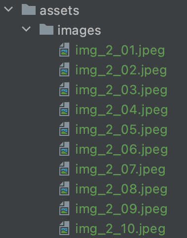
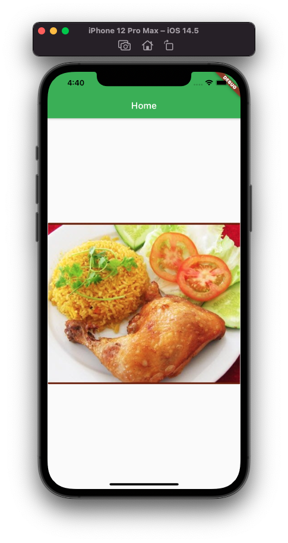
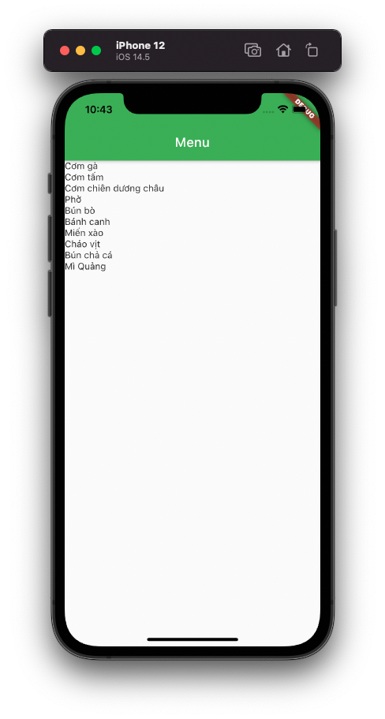
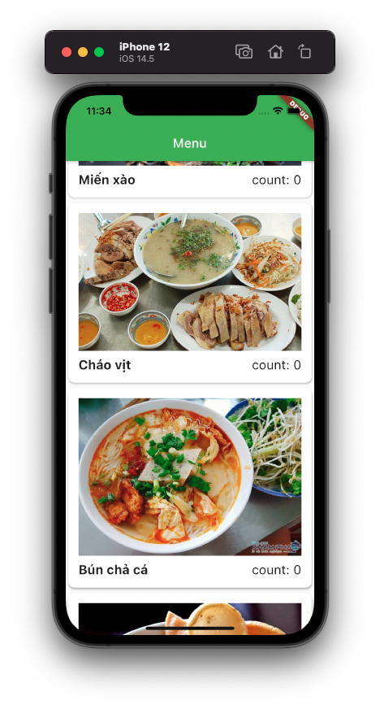
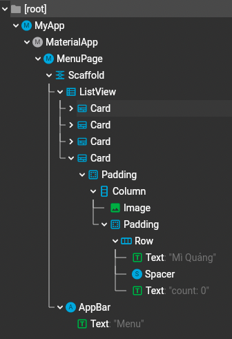
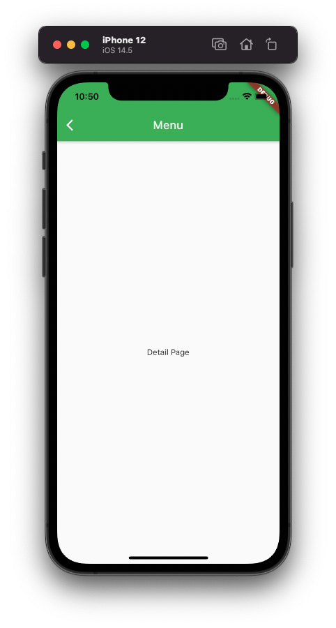
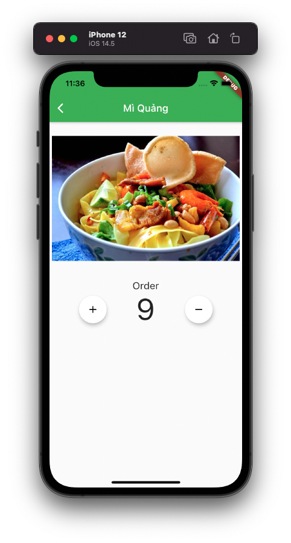
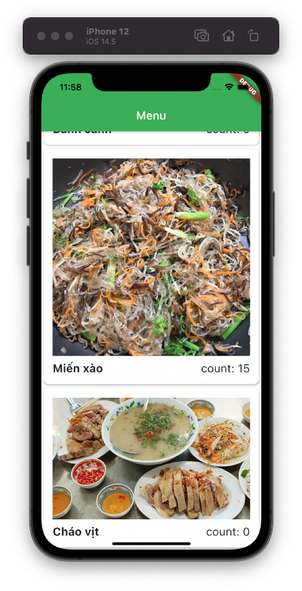
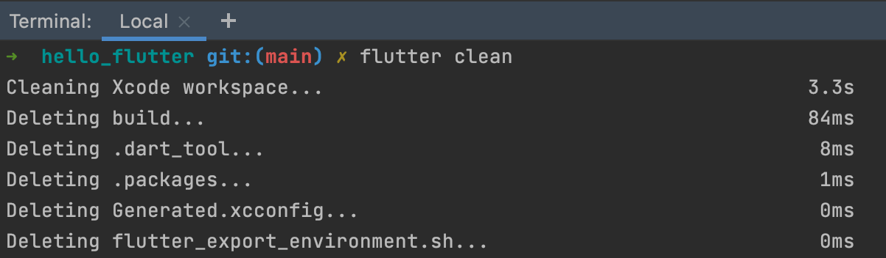

# 01.4 - Make color App

Chào mừng bạn đến với **Fx Studio**. Bạn đã khám phá một Flutter Project có những gì thông qua bài viết trước rồi. Tiếp theo, bài viết này sẽ giúp bạn hoàn thiện ứng dụng Flutter đầu tiên của bạn. Nó cũng khá đơn giản thôi và giúp bạn tạo ứng dụng với nhiều màn hình. 

Nếu mọi việc đã ổn rồi, thì ...

> Bắt đầu thôi!

## Chuẩn bị

Về mặt tool và version, các bạn tham khảo như sau:

* Android Studio : Arctic Fox | 2020.3.1
* Flutter : 2.2.3
* Dart : 2.13.4

Về mặt demo, ta sẽ tiếp tục sử dụng tiếp project ở bài viết trước. Chúng ta sẽ tạo các màn hình mới, do đó bạn cũng không cần lo lắng nhiều quá. Ahihi!

## Add Resources

Một project thì bạn sẽ thêm rất nhiều tài nguyên bên ngoài. Như là *image, font, audio* ... Nó giúp cho bạn tạo giao diện được đẹp hơn, hoặc những gì mà hệ thống không cung cấp được cho bạn. Do đó, việc đầu tiên bạn cần làm là có thể thêm được những files tài nguyên vào project.

### Add files

Bước đầu tiên, bạn cần tạo một thư mục và đặt tên là **assets** trong project. Chúng ta có nhiều loại tài nguyên khác nha và trong project này mình sử dụng ảnh là chính. Nên sẽ tạo thêm 1 thư mục **images** nữa bên trong **assets**. Sau đó, bạn thêm các ảnh cần thiết vào **images**.



### pubspec.yaml

Cuối cùng, muốn cho các đoạn code nhận được file thì bạn cần khai báo thêm vào file **pubspec.yaml.** Bạn mở file đó lên và tìm tới phần `assest`. Bỏ đi các kí tự `#`, và thêm các dòng khai báo cho các image mà bạn sử dụng.

```dart
  assets:
    - assets/images/img_2_01.jpeg
    - assets/images/img_2_02.jpeg
    - assets/images/img_2_03.jpeg
    - assets/images/img_2_04.jpeg
    - assets/images/img_2_05.jpeg
    - assets/images/img_2_06.jpeg
    - assets/images/img_2_07.jpeg
    - assets/images/img_2_08.jpeg
    - assets/images/img_2_09.jpeg
    - assets/images/img_2_10.jpeg
```

 Nó sẽ trông như vậy. Tới đây thì bạn sẽ ... quá là khổ khi phải thêm bằng tay như thế này. Ahuhu!

> Khóc vì chia xa Xcode rồi :(

Và mỗi lần bạn thay đổi file **pubspec.yaml** thì bạn cần chạy các lệnh sau:

```shell
flutter pub get
```

Hoặc

```shell
fullter pub upgrade
```

Khi đó project của bạn sẽ được cập nhật đầy đủ những gì mà bạn đã có khai báo và thay đổi ở **pubspec.yaml**.

### Test

Bạn phải chú ý kĩ đường dẫn nhoé. Rất dễ sai sót ở đây. Còn để test ảnh có được thêm vào thành công hay không thì bạn thử đoạn code sau đây vào **HomePage** nhoé.

```dart
class HomePage extends StatelessWidget {
  @override
  Widget build(BuildContext context) {
    return new Scaffold(
      appBar: AppBar(
        title: Text("Home"),
      ),
      body: new Center(
        child: Image.asset('assets/images/img_2_01.jpeg'),
      ),
    );
  }
}
```

Để hiển thị một ảnh từ **assests**, thì bạn sử dụng `Image.asset`. Điền đúng đường dẫn như đã khai báo vào nhoé.



## Data Model

Một phần không thể thiếu trong project là các lớp cho các **Data Model**. Đây là đại diện cho các đối tượng lưu trữ dữ liệu của bạn. Bạn sẽ tạo ra nhiều lớp cho nhiều kiểu dữ liệu mà bạn sẽ dùng trong ứng dụng. Và với Flutter thì cũng không khác các nền tảng khác, ta sẽ phải khai báo các class để định nghĩa chúng.

> Bạn sẽ sử dụng cú pháp của ngôn ngữ Dart nhoé!

Ta sẽ tạo một file `menu_item.dart` và khai báo class **MenuItem** như sau:

```dart
class MenuItem {
  String name;
  String thumbnail;
  int count;

  MenuItem(this.name, this.thumbnail, {this.count = 0});
}
```

Trong đó:

* **MenuItem** có 3 thuộc tính là `name`, `thumbnail` và `count`
* Sử dụng hàm khởi tạo rút gọn với giá trị mặc định cho `count`

Để có được dữ liệu ban đầu cho ứng dụng thì ta thêm một `dummy data` trong class **MenuItem** như sau:

```dart
  // dummy data
  static List<MenuItem> dummyData = [
    MenuItem('Cơm gà', 'assets/images/img_2_01.jpeg'),
    MenuItem('Cơm tấm', 'assets/images/img_2_02.jpeg'),
    MenuItem('Cơm chiên dương châu', 'assets/images/img_2_03.jpeg'),
    MenuItem('Phở', 'assets/images/img_2_04.jpeg'),
    MenuItem('Bún bò', 'assets/images/img_2_05.jpeg'),
    MenuItem('Bánh canh', 'assets/images/img_2_06.jpeg'),
    MenuItem('Miến xào', 'assets/images/img_2_07.jpeg'),
    MenuItem('Cháo vịt', 'assets/images/img_2_08.jpeg'),
    MenuItem('Bún chả cá', 'assets/images/img_2_09.jpeg'),
    MenuItem('Mì Quảng', 'assets/images/img_2_10.jpeg'),
  ];
```

Trong đó:

* `List<MenuItem>` là một Array kiểu **MenuItem**
* Khai báo `static` để dùng với kiểu **Class Type**

## Master Page

### Create files

Công việc chính của chúng ta sẽ là hiển thị **Array MenuItem** lên màn hình nhoé. Ta tạo thêm một file `menu_page.dart` và khai báo class **MenuPage** với kiểu là **StatefulWidget**. Bạn tham khảo đoạn code sau:

```dart
class MenuPage extends StatefulWidget {
  @override
  State<StatefulWidget> createState() => _MenuPageState();
}

class _MenuPageState extends State<MenuPage> {
  @override
  Widget build(BuildContext context) {
    return new Scaffold(
        appBar: AppBar(
          title: Text("Menu"),
        ),
        body: new Center(
          child: Text("Ahihi!"),
        )
    );
  }
}
```

Phần này, bạn đã biết cách tạo trong bài viết trước rồi. Nên cũng không có gì mới ở đây. 

> Bạn có thể dùng hoặc không dùng từ khoá `new` để tạo một đối tượng Widgets hoặc bất cứ đối tượng nào cũng được.

### Display a simple ListView

Bạn khai báo thêm một thuộc tính cho lớp State nhoé.

```dart
final menus = MenuItem.dummyData;
```

`menus` sẽ là dữ liệu của chúng ta và dùng dữ liệu `dummy data` ở trên mà bạn đã khai báo.

Sau khi đã có dữ liệu, ta sẽ dùng Widget **ListView** để hiển thị một danh sách lên giao diện. Bạn tham khảo code như sau nhoé:

```dart
class _MenuPageState extends State<MenuPage> {
  final menus = MenuItem.dummyData;

  @override
  Widget build(BuildContext context) {
    return new Scaffold(
        appBar: AppBar(
          title: Text("Menu"),
        ),
        body: ListView.builder(
            itemCount: menus.length,
            itemBuilder: (BuildContext context, int index) {
              return Text(menus[index].name);
            }));
  }
}
```

Trong đó:

* Widget sử dụng cho hiển thị danh sách là **ListView**
* Sử dụng `ListView.builder` để duyệt các phần tử lần lượt. Với tổng số lượng item là tổng phần tử của Array ( `menus.length` )
* Tham số `itemBuilder` là một hàm ẩn danh. Nhiệm vụ sẽ trả về 1 Widget sau mỗi bước lặp.
* Tại mỗi bước lặp trả về 1 Widget là Text, với nội dung là `name` của đối tượng MenuItem trong `menus`

Okay, bạn build lại ứng dụng và xem kết quả nhoé.



Nhìn xấu quá ta!

### Custom Row

Chúng ta lại tiếp tục cải thiện giao diện cho **ListView**, với việc Custom lại Row cho đẹp hơn. Bạn xem qua đoạn code ví dụ sau:

```dart
  Widget buildRow(MenuItem menu) {
    return Card(
        elevation: 2.0,
        shape:
            RoundedRectangleBorder(borderRadius: BorderRadius.circular(10.0)),
        child: Padding(
          padding: const EdgeInsets.all(16.0),
          child: Column(
            children: [
              Image.asset(menu.thumbnail),
              Padding(
                padding: const EdgeInsets.only(top: 10.0),
                child: Row(
                  children: [
                    Text(
                      menu.name,
                      style: TextStyle(
                          fontWeight: FontWeight.bold, fontSize: 20.0),
                    ),
                    Spacer(),
                    Text('count: ${menu.count}',
                        style: TextStyle(fontSize: 20.0))
                  ],
                ),
              )
            ],
          ),
        ));
  }
```

Trong đó:

* Function `buildRow` với kiểu trả về là một **Widget**, sẽ đóng vài trò tạo ra giao diện cho Row của chúng ta. Đi kèm là tham số `menu` với kiểu là **MenuItem**, sẽ làm dữ liệu cho Row.
* `buildRow` sẽ trả về một Widget là **Card**. Ta sẽ thêm các thành phần giao diện vào trong tham số `child` của **Card**.
* Nội dung chính `child` của Card là bao gồm 1 **Image** & 2 **Text** để hiển thị nội dung item. Chúng được bố trí để có layout như ý muốn.

> Layout và các Widget trong đó thì bạn sẽ tìm hiểu ở các phần sau nhoé.

Tiếp theo, bạn cập nhật tại `itemBuilder` ở ListView, bằng cách gọi hàm `buildRow` nhoé.

```dart
ListView.builder(
    itemCount: menus.length,
    itemBuilder: (BuildContext context, int index) {
      return buildRow(menus[index]);
}) 
```

Như vậy là chúng ta đã custom giao diện cho một Row. Bạn bấm **Hot Restart** và xem kết quả nhoé!



Lúc này nhìn giao diện của chúng ta ổn rồi đó. Ahihi!

## Widgets Tree

Khi bạn mới bắt đầu với Flutter thì khi nhìn vào đám Widget là khá là chóng mặt. Chúng nó lồng nhau quá nhiều cấp, trông loạn cả lên. Tuy nhiên, có một cách nhìn dễ hơn, đó là **Widget tree**.

Để xem được **Widget Tree**, thì bạn sử dụng Flutter Inspector có trong Dev Tools của nó. Bạn vào **Menu > View > Tool Windows > Flutter Inspector**. Trong ví dụ của chúng ta thì sẽ trông như thế này



- **Widget Tree** chỉ đơn giản là tất cả các Widget mà bạn đang dùng để xây dựng ứng dụng, tức là code mà bạn viết sẽ tạo nên widget tree.‌‌
- Nó hoàn toàn do bạn kiểm soát. Bạn khai báo các widget lồng ghép chúng lại với nhau để tạo nên bố cục mong muốn.‌‌
- Cái Tree này được xây dựng bởi Flutter khi call phương thức `build(){...}` từ code của chúng ta, chúng chỉ là một loạt các cài đặt cấu hình mà Flutter sẽ xử lý.‌‌
- Nó không chỉ đơn giản xuất hiện ra trên màn hình rồi thôi. Thay vào đó, nó sẽ cho Flutter biết những gì sẽ vẽ lên màn hình ở lần tiếp theo. Widget tree được rebuild rất thường xuyên.‌‌

## Detail Page

Chúng ta sẽ thêm một màn hình nữa cho ứng dụng đầu tiên này. Bạn cần thêm một file `detail_page.dart` và tạo một màn hình với tên là **DetailPage**. Và sử dụng **StatefulWidget** nhoé. Tham khảo code cơ bản như sau:

```dart
class DetailPage extends StatefulWidget {
  @override
  State<StatefulWidget> createState() => _DetailPageState();
}

class _DetailPageState extends State<DetailPage> {
  @override
  Widget build(BuildContext context) {
    return new Scaffold(
        appBar: AppBar(
          title: Text("Menu"),
        ),
        body: Center(
          child: Text("Detail Page"),
        )
    );
  }

}
```

Đây là mô hình **Master - Detail** cơ bản nhất trong ứng dụng mobile. Trong một ứng dụng thì bạn phải tương tác giữa nhiều màn hình với nhau. Quan trong nhất vẫn là 2 việc:

* Điều hướng màn hình
* Truyền tải dữ liệu

### Goto Detail

Chúng ta bắt tay vào việc đầu tiên chính là **điều hướng**. Công việc này có nghĩa bạn sẽ di chuyển từ màn hình **MasterPage** sang **DetailPage**. Sự kiện để việc này diễn ra là người dùng `tap` vào các **Row** của **ListView** trong **MasterPage**.

Với Flutter thì mọi thứ là Widget, nên cho tới việc cảm ứng nhấn vào một item cũng là Widget luôn. Bạn cần sử dụng tới Widget này **GestureDetector** cho `itemBuilder` của **ListView** nhoé. Tham khảo code ví dụ sau:

```dart
              return GestureDetector(
                onTap: () {
                  Navigator.push(context, MaterialPageRoute(builder: (context) {
                    return DetailPage();
                  }));
                },
                child: buildRow(menus[index]),
              );
```

Trong đó:

* **GestureDetector** là widget giúp ta có thể lắng nghe các sự kiện người dùng lên giao diện. Ta sử dụng `onTap`
* **GestureDetector** có tham số `child`, ta sẽ dùng tới `buildRow` để trả về cho **GestureDetector** một widget. Lúc này, **GestureDetector** được xem là **Row** của **ListView** rồi nhoé.
* Tại `onTap` thì **Navigator** là quản lý các `stack pages`, tương tự như *UINavigationController* trong iOS.
* Sử dụng `.push` để đưa một **Router Page** vào ngăn xếp. 
* **MaterialPageRoute** với `builder` tạo ra một Page đích đến chính là **DetailPage**

Đó là cách đơn giản nhất để bạn có thể điều hướng từ màn hình này sang màn hình khác. Bấm **Hot Restart** và test nhoé.



### Passing Data to Detail Page

Công việc tiếp theo là bạn sẽ phải truyền dữ liệu từ **MasterPage** sang **DetailPage**. Chiều này khá đơn giản, ta sẽ phải khai báo thêm thuộc tính cho **DetailPage** trước tiên. Bạn tham khảo ví dụ nhoé.

````dart
class DetailPage extends StatefulWidget {

  final MenuItem item;

  const DetailPage({Key? key, required this.item}) : super(key: key);

  @override
  State<StatefulWidget> createState() => _DetailPageState();
}
````

Trong đó:

* Thuộc tính `item` có kiểu là **MenuItem**. Ta sẽ khai báo nó với `final` với mục đích nhận dữ liệu tại lúc **run-time**.
* Khai bám thêm một **Constaint Constructor** cho **DetailPage** với 2 tham số
  * `key` ta sẽ tìm hiểu nó sau nhoé
  * `item` chính là phần tử từ array `menus` của **MasterPage**

Tại ListView của MasterPage, ta sẽ chỉnh lại việc tạo đối tượng **DetailPage** như sau:

````dart
DetailPage(item: menus[index]);
````

Như vậy là bạn hoàn thành việc truyền dữ liệu từ **Master** sang **Detail** rồi đấy.

### Create UI

Tiếp theo, chúng ta sẽ tới phần tạo giao diện cho màn hình **DetailPage**. Ta sẽ tập tập vào class **_DetailPageState** và hàm `build` của nó.

Tiết kiệm thời gian, thì bạn tham khảo code ví dụ nhoé

```dart
class _DetailPageState extends State<DetailPage> {
  @override
  Widget build(BuildContext context) {
    return new Scaffold(
        appBar: AppBar(
          title: Text(widget.item.name),
        ),
        body: Column(
          children: [
            Padding(
                padding: const EdgeInsets.all(5.0),
                child: SizedBox(
                  height: 300,
                  width: double.infinity,
                  child: Image(image: AssetImage(widget.item.thumbnail)),
                )),
            const SizedBox(height: 10),
            Column(
              mainAxisAlignment: MainAxisAlignment.center,
              children: [
                Text("Order", style: TextStyle(fontSize: 20.0)),
                Row(
                  mainAxisAlignment: MainAxisAlignment.spaceEvenly,
                  children: <Widget>[
                    new FloatingActionButton(
                      onPressed: () {
                        setState(() {
                          widget.item.count += 1;
                        });
                      },
                      child: new Icon(Icons.add, color: Colors.black,),
                      backgroundColor: Colors.white,),
                    new Text('${widget.item.count}', style: new TextStyle(fontSize: 60.0)),
                    new FloatingActionButton(
                      onPressed: () {
                        setState(() {
                          if (widget.item.count > 0) {
                            widget.item.count -= 1;
                          }
                        });
                      },
                      child: new Icon(Icons.remove, color: Colors.black,),
                      backgroundColor: Colors.white,),
                  ],
                ),
              ],
            )
          ],
        )
    );
  }
}
```

Vẫn là bố cục bình thường thôi, bạn sẽ học dần chúng trong các chương sau. Nên cũng không cần lo lắng gì nhiều. Trong đó ta cần chú ý tới:

* Xét `title` theo dữ liệu của `item`

````dart
appBar: AppBar(
   title: Text(widget.item.name),
),
````

* Hiển thị ảnh của `item`

```dart
Image(image: AssetImage(widget.item.thumbnail)),
```

* Hiển thị số lượng `count` của `item`

```dart
Text('${widget.item.count}', style: new TextStyle(fontSize: 60.0)),
```

* Xét lại State với `setState` khi bạn muốn hiển thị giá trị `count` đã thay đổi lên giao diện.

```dart
setState(() {
   widget.item.count += 1;
});
```

Bạn bấm lại **Hot Restar**t và test lại nhoé.



### Call back

Nếu bạn để ý thì dữ liệu array `menus` ở **MasterPage** cũng sẽ thay đổi khi ta thay đổi dữ liệu `item` ở **DetailPage**. Vì chúng có **quan hệ tham chiếu** với nhau, do ta truyền phần tử của array vào hàm khởi tạo của **DetailPage**. Như vậy thì bạn khá an tâm về mặt giá trị của dữ liệu rồi.

Tuy nhiên, cảm giác hiển thị trên **ListView** không được mượt mà cho lắm. Nguyên nhân là **Flutter** không **render** đúng thời điểm. Nó chỉ **render** lại `itemBuilder` khi bạn scroll mà thôi.

Và bài toán của chúng ta là sẽ thông báo thời điểm cho **ListView** ở **MasterPage** cập nhật lại trạng thái. Mà việc thông báo này lại diễn ra từ sự kiện ở **DetailPage**. Để cho dễ hiểu thì ta gọi là

> Call back

Bắt đầu tại **DetailPage** ta sẽ khai báo thêm thuộc tính là kểu **Function** để thực hiện việc phản hồi này. 

> Tương tự như closure và completion trong Swift nhoé!

```dart
  final Function callback;

  const DetailPage({Key? key, required this.item, required this.callback}) : super(key: key);
```

Bạn cũng phải cập nhật lại hàm khởi tạo của **DetailPage** luôn nhoé. Cách dùng `callback` thì rất đơn giản. Ví dụ như sau:

```dart
onPressed: () {
   setState(() {
     widget.item.count += 1;
   });
   widget.callback();
},
```

Chỗ nào bạn muốn phản hồi thì triệu hồi `widget.callback();` thôi. EZ nhĩ!

Cuối cùng, bạn cập nhật lại hàm khởi tạo **DetailPage** ở **MasterPage**.

```dart
DetailPage(item: menus[index], callback: refresh);
```

Với hàm `refresh` thì bạn sẽ khai báo thêm ở MasterPage. Vì chỉ đơn giản là hứng sự kiện nên ta không có xử lý gì. Chỉ họi lại `setState()` cho **ListView** cập nhật lại giao diện mà thôi.

```dart
  refresh() {
    setState(() {});
  }
```

Bạn bấm Hot Restart và test lại nhoé. Chúc bạn thành công!



## Clean Project

Rất ít bạn sẽ để ý tới việc dọn dẹp project sau khi bạn đã hoàn thành nhiệm vụ. Với Flutter là một nền tảng **cross-platform** và nó sẽ sinh ra các project cho các nền tảng native khác nhau. Khi mỗi lần bạn sử dụng, build ... trên máy ảo hay thiết bị thì Flutter sẽ sinh ra thêm một thư mục là `build`.

Các file build cho các nền tảng như là `*.apk`, `*.ipa` ... chúng nó thật sự khá nặng. Flutter cũng chưa tối ưu bản build, ví dụ như với **BitCode** ... Và trong lúc học Flutter bạn sẽ tạo ra rất nhiều Project khác nhau. Kiểu như là thích thì tạo vậy.

Dần dần, nó sẽ chiếm dung lượng bộ nhớ của máy tính của bạn. Với các bạn đang dùng **Macbook** thì điều này khá kinh khủng. Dung lượng có lúc lên tới vài trăm MB là chuyện bình thường.

Vì vậy, theo kinh nghiệm bản thân. Mình khuyên bạn nên dọn dẹp lại Project sau mỗi lần hoàn thành một task lớn. Hoặc kết thúc project. Còn việc dọn dẹp khá đơn giản. Bản mở Terminal và `cd` tới thư mục project. Và chạy lệnh:

```dart
flutter clean
```

Fullter xem dọn dẹp giúp bạn, xoá bộ đêm, xoá các file build ...



Sau đó, IDE sẽ báo bạn cần chạy lại lệnh `flutter pub get` để thêm các dependency cho project. Và bây giờ, bạn sẽ hiều vì sao

> Mình dùng đi dùng lại 1 project duy nhất cho 3~4 bài viết rồi đây. Ahihi!

## Tạm kết

Qua trên thì đã hoàn thiện một ứng dụng khá đơn giản với Flutter rồi. Bao gồm các công việc:

* Thêm các tài nguyên cho project.
* Tạo các Data Model và dữ liệu cho ứng dụng.
* Hiển thị một danh sách với dữ liệu được tạo. Custom Row để có giao diện đẹp lơn cho danh sách.
* Điều hướng với Navigator cho 2 màn hình cơ bản. Từ đó, biết được cách xử lý cho một ứng dụng với nhiều màn hình.
* Truyền dữ liệu qua lại giữa các màn hình với nhau.
* Sử dụng được **callback** trong việc truyền sự kiện theo chiều ngược lại giữa hai màn hình.
* Quản lý dữ liệu giữa 2 màn hình bằng các tham chiếu cần thiết.
* Cách dọn dẹp Project, xoá bộ đệm và các bản build.

---

Cảm ơn bạn đã theo dõi các bài viết từ **Fx Studio** & hãy truy cập [website](https://fxstudio.dev/) để cập nhật nhiều hơn!
